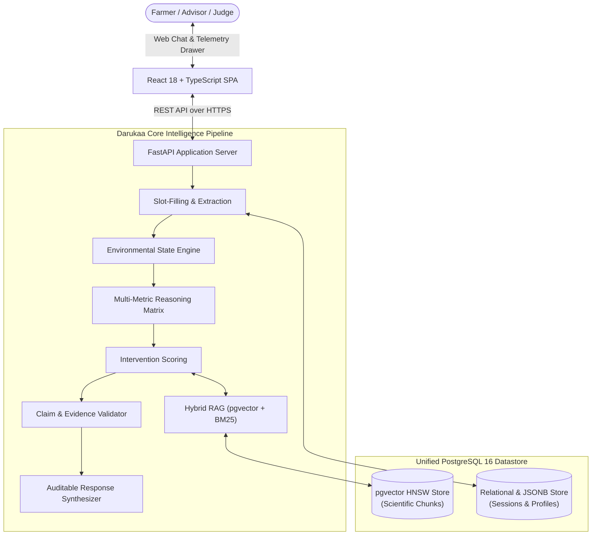

# 🌍 Darukaa.Earth

> **Evidence-Grounded AI Biodiversity Intelligence & Environmental Decision Engine**

[](./LICENSE)
[](https://www.python.org/)
[](https://fastapi.tiangolo.com/)
[](https://react.dev/)
[](https://github.com/pgvector/pgvector)

---

## 📌 Executive Summary

**Darukaa.Earth** is an automated Environmental Scientist that solves agricultural land degradation and biodiversity collapse. Unlike naive LLM chatbots or basic semantic RAG search bars, Darukaa.Earth couples **empirical physical telemetry** (soil physics, microclimatic data, cropping history) with a **deterministic multi-metric reasoning engine**, **peer-reviewed scientific literature RAG (FAO, IPCC, IPBES)**, and a **post-generation claim validation pipeline**.

```text
       ┌─────────────────────────────────────────────────────────────┐
       │                       DARUKAA.EARTH                         │
       │                                                             │
       │   Structured Environmental Telemetry (Soil, Climate, Land)  │
       │                              +                              │
       │         Deterministic Multi-Metric Compound Reasoning       │
       │                              +                              │
       │             Authoritative Scientific Literature             │
       │                              +                              │
       │            Post-Generation Claim & Citation Verifier        │
       └─────────────────────────────────────────────────────────────┘
                                      │
                                      ▼
                   Auditable, Science-Backed Interventions
                     with Explicit Trade-Offs & Confidence
```

---

## 🚀 The Hackathon Differentiator: Why This is Not a Chatbot

| Feature | Generic LLM Chatbot | Basic Naive RAG | Darukaa.Earth |
| :--- | :--- | :--- | :--- |
| **Environmental Reasoning** | Hallucinated heuristics | Naive text stitching | **Deterministic threshold matrix & cross-metric stress calculation** |
| **Input Incompleteness** | Guesses or assumes missing variables | Answers blindly without context | **Proactive slot-filling and targeted clarifying queries** |
| **Data Types** | Unstructured text only | Text chunks only | **Structured telemetry + relational ontology + semantic chunks** |
| **Scientific Grounding** | Imagined citations | Top-k vector snippets | **Hierarchical institutional sources (FAO, IPCC, IPBES) with chunk IDs** |
| **Fact Checking** | None | None | **Automated post-generation claim validation pipeline** |
| **Trade-Off Analysis** | Overly optimistic generalizations | Often omitted | **Explicit matrix showing risk vs ecological vs economic tradeoffs** |
| **Confidence Scoring** | Black-box answer | None | **Mathematical composite confidence score (0.0 to 1.0)** |

---

## 🏛️ High-Level System Architecture



---

## 🛠️ Technology Stack

* **Frontend:** React 18, TypeScript, Vite, Tailwind CSS, Lucide Icons, Zustand.
* **Backend:** FastAPI (Python 3.11), Pydantic v2, SQLAlchemy 2.0.
* **Database & Vector Store:** PostgreSQL 16 with native `pgvector` extension and HNSW indexing.
* **Embeddings & LLM:** OpenAI `text-embedding-3-small` (1536 dims) + `gpt-4o`.
* **Scientific Corpus:** Curated, peer-reviewed chapters from FAO, IPCC, and IPBES.
* **Orchestration:** Docker Compose (single-command local/cloud launch).

---

## ⚡ Quick Start (Run in 5 Minutes)

### Prerequisites
* Docker & Docker Compose installed.
* An OpenAI API key (`OPENAI_API_KEY`).

### Launch Steps
```bash
# 1. Clone the repository
git clone https://github.com/your-org/darukaa-earth.git
cd darukaa-earth

# 2. Configure environment variables
cp .env.example .env
# Edit .env and insert your OPENAI_API_KEY

# 3. Launch all services (Database + Backend + Frontend)
docker-compose up --build -d

# 4. Initialize database and seed scientific knowledge corpus (FAO / IPCC chunks)
docker-compose exec backend python backend/db/init_db.py

# 5. Open your browser
# Web Application:  http://localhost:3000
# OpenAPI Docs:     http://localhost:8000/docs (Docker) or http://localhost:8005/docs (Local)
```

### Local Development (Without Docker)
```bash
# Backend (FastAPI on http://localhost:8005)
.\venv\Scripts\python.exe -m uvicorn backend.main:app --host 0.0.0.0 --port 8005 --reload

# Frontend (Vite on http://localhost:3000)
cd frontend && npm run dev
```

---

## 📚 Complete Technical Documentation Index

For detailed architectural, mathematical, and implementation specifications, explore our **22-document technical suite**:

| Section | Document | Key Highlights |
| :--- | :--- | :--- |
| **Index** | [00 — Master Documentation Index](./docs/00_DOCUMENTATION_INDEX.md) | Reading orders, persona guides, full directory tree. |
| **Vision** | [01 — Project Overview](./docs/01_PROJECT_OVERVIEW.md) | Problem statement, user personas, differentiators. |
| **Architecture** | [02 — System Architecture](./docs/02_SYSTEM_ARCHITECTURE.md) | C4 context diagrams, component breakdowns, data planes. |
| **Design** | [03 — System Design](./docs/03_SYSTEM_DESIGN.md) | End-to-end execution flows, sequence diagrams. |
| **Data** | [04 — Data Architecture](./docs/04_DATA_ARCHITECTURE.md) | 4-tier data model (telemetry, semantic, relational, state). |
| **Database** | [05 — Database Design](./docs/05_DATABASE_DESIGN.md) | PostgreSQL 16 DDL, pgvector HNSW index, ER diagram. |
| **Knowledge** | [06 — Knowledge Base](./docs/06_KNOWLEDGE_BASE.md) | FAO/IPCC scientific taxonomy, authority hierarchy. |
| **RAG** | [07 — RAG Architecture](./docs/07_RAG_ARCHITECTURE.md) | Hybrid search (pgvector + BM25), Reciprocal Rank Fusion. |
| **Reasoning** | [08 — Reasoning Engine](./docs/08_REASONING_ENGINE.md) | Deterministic multi-metric matrix, compound risk formulas. |
| **Recommendations**| [09 — Recommendation Engine](./docs/09_RECOMMENDATION_ENGINE.md) | Multi-objective scoring algorithm, intervention JSON schema. |
| **Validation** | [10 — Evidence Validation](./docs/10_EVIDENCE_VALIDATION.md) | Post-generation claim matching, anti-hallucination pruning. |
| **Memory** | [11 — Conversation Memory](./docs/11_CONVERSATION_MEMORY.md) | Dynamic slot-filling, accumulated profile persistence. |
| **API** | [12 — API Design](./docs/12_API_DESIGN.md) | FastAPI REST endpoints, OpenAPI schemas, JSON payloads. |
| **Frontend** | [13 — Frontend Architecture](./docs/13_FRONTEND_ARCHITECTURE.md) | React 18 component tree, Zustand store, UI wireframe. |
| **Flows** | [14 — User Flows](./docs/14_USER_FLOWS.md) | 8 detailed user journeys and interaction diagrams. |
| **Deployment** | [15 — Deployment Architecture](./docs/15_DEPLOYMENT_ARCHITECTURE.md) | 24h Hackathon Docker deploy vs AWS ECS/RDS production target. |
| **Security** | [16 — Security & Reliability](./docs/16_SECURITY_RELIABILITY.md) | Input sanitization, prompt safety, fallback circuit breakers. |
| **Testing** | [17 — Testing Strategy](./docs/17_TESTING_STRATEGY.md) | Unit tests, pytest commands, and 10 benchmark test cases. |
| **Plan** | [18 — MVP Implementation Plan](./docs/18_MVP_IMPLEMENTATION_PLAN.md) | 24-hour hour-by-hour sprint schedule and priority matrix. |
| **Demo** | [19 — Demo Script](./docs/19_DEMO_SCRIPT.md) | 3.5-minute live hackathon presentation and pitch script. |
| **Defense** | [20 — Judge Q&A](./docs/20_JUDGE_QA.md) | 15 tough technical and scientific questions with direct answers. |
| **Roadmap** | [21 — Future Roadmap](./docs/21_FUTURE_ROADMAP.md) | Hackathon MVP vs Version 2 (Copernicus/GIS) vs Enterprise. |

---

## 🧪 Testing

Execute the automated test suite and AI reasoning benchmarks:

```bash
# Run all 33 system, reasoning, RAG, and compliance tests
pytest backend/tests/test_system.py -v

# Run the comprehensive 26-check live audit suite
python scripts/comprehensive_audit.py

# Clean caches and package a clean shareable distribution zip
python scripts/prepare_for_sharing.py
```

---

## 📄 License

This project is licensed under the MIT License — see the [LICENSE](./LICENSE) file for details.
