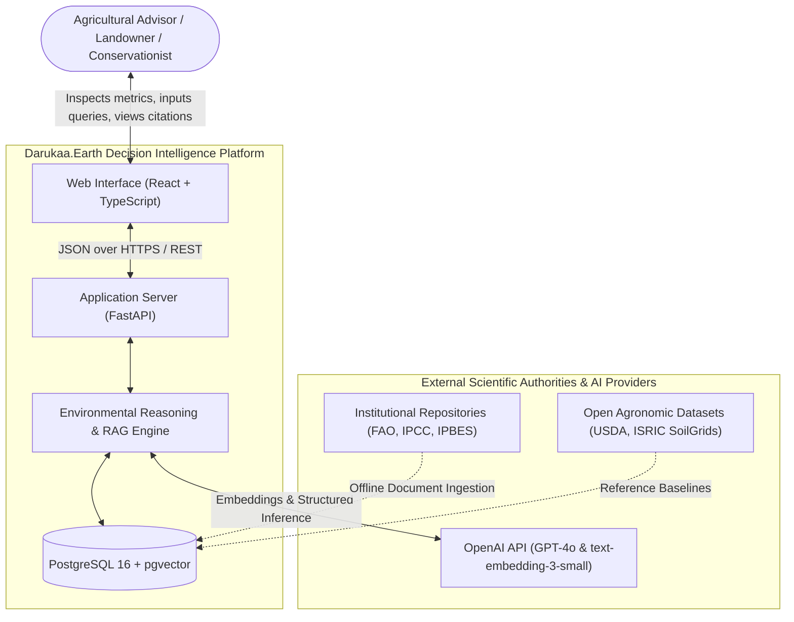
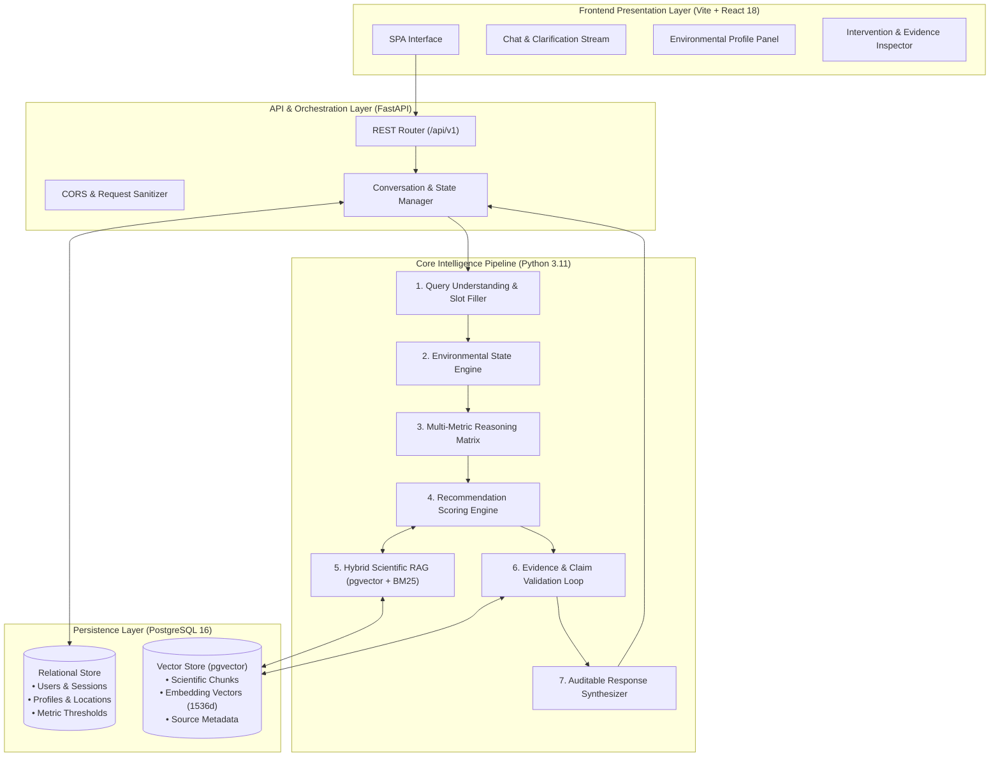
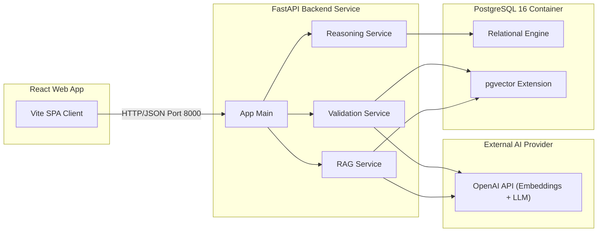

# 02 — System Architecture

> **Navigation:** [Index](./00_DOCUMENTATION_INDEX.md) | **Previous:** [Project Overview](./01_PROJECT_OVERVIEW.md) | **Next:** [System Design](./03_SYSTEM_DESIGN.md)

---

## 1. Architectural Philosophy

Darukaa.Earth is engineered around a **dual-plane architecture**:
1. **The Deterministic Computational Plane:** Pure Python mathematical threshold calculations, multi-metric stress state machines, and relational constraint matrices.
2. **The Semantic & Scientific Plane:** PostgreSQL + `pgvector` hybrid retrieval, semantic document embeddings, LLM contextual summarization, and post-generation claim validation.

This design guarantees that ecological recommendations are bounded by empirical constraints and verified scientific consensus, preventing unsupervised generative hallucinations.

---

## 2. System Context Diagram (C4 Level 1)

---

## 3. High-Level Architecture Diagram (C4 Level 2)

---

## 4. Component Breakdown & Responsibilities

### 1. Presentation Layer (React 18 + TypeScript)
* **Chat Window:** Displays conversational flow, proactive clarifying questions, and interactive intervention summaries.
* **Environmental Profile Drawer:** Live dashboard reflecting the current accumulated telemetry (SOC, pH, moisture, rainfall, land use, temperature).
* **Evidence Panel:** Interactive citation drawer showing exact excerpts, author, publication year, DOI, and chunk confidence.

### 2. API & Conversation Orchestration (FastAPI)
* **Conversation Manager:** Tracks session tokens, stores user message histories, and passes accumulated context to the reasoning pipeline.
* **Slot-Filling Parser:** Evaluates user messages against the target `EnvironmentalProfile` schema. If key parameters are missing, pauses full reasoning to issue a clarifying request.

### 3. Core Intelligence Engine
* **Environmental State Engine:** Maps raw numeric telemetry to qualitative stress classes (`LOW`, `MODERATE`, `CRITICAL`) using standardized agronomic scales.
* **Multi-Metric Reasoning Engine:** Applies combinatorial logic to detect compound multi-variable risks (e.g., Low SOC + Low Precipitation + Monoculture = Extreme Water Vulnerability & Biodiversity Collapse).
* **Recommendation Engine:** Evaluates candidate ecological interventions against regional biomes, calculates multidimensional utility scores, and filters out non-viable practices.
* **Hybrid Scientific RAG:** Executes dual-stage retrieval (HNSW cosine similarity on `pgvector` + full-text search on PostgreSQL `tsvector`) with Reciprocal Rank Fusion (RRF).
* **Evidence Validation Loop:** Parses claims made in draft recommendations, validates factual overlap against retrieved peer-reviewed chunks, and prunes or downgrades unsupported assertions.
* **Response Synthesizer:** Formats output into structured JSON containing clean markdown narrative, tabular trade-offs, and explicit source links.

### 4. Data Layer (PostgreSQL 16 + pgvector)
* Uses a single PostgreSQL database instance, eliminating distributed transaction overhead.
* Handles both standard relational entities (users, sessions, metrics, locations) and high-dimensional vector embeddings with HNSW indexing.

---

## 5. Service Dependency Diagram

---

## 6. External Systems & Scientific Provenance

| System | Role in Darukaa.Earth | Interaction Mechanism | Resilience Strategy |
| :--- | :--- | :--- | :--- |
| **OpenAI API** | High-dimensional embeddings (`text-embedding-3-small`) & final narrative generation (`gpt-4o`) | Asynchronous HTTP client via official SDK with exponential backoff | Cached embeddings, fallback to local rule-based templates if API unavailable |
| **FAO Documents** | Authoritative soil management guidelines, conservation agriculture field manuals | Offline pre-processed PDFs ingested into `pgvector` | Pre-embedded during database initialization; no live runtime dependency |
| **IPCC Land Reports** | Climate risk indicators, desertification vulnerability models | Pre-processed chapter chunks with DOI metadata | Fully offline in local database |
| **IPBES Assessments** | Global biodiversity metrics, pollinator decline indicators | Curated summaries stored in relational and vector tables | Fully offline in local database |

---

## 7. Cross-Document Navigation

* For detailed operational lifecycles and sequence flows, see [03_SYSTEM_DESIGN.md](./03_SYSTEM_DESIGN.md).
* For database schema definitions and indexing configurations, see [05_DATABASE_DESIGN.md](./05_DATABASE_DESIGN.md).
* For the mathematical formulation of multi-metric reasoning, see [08_REASONING_ENGINE.md](./08_REASONING_ENGINE.md).
* For the API contract specifications, see [12_API_DESIGN.md](./12_API_DESIGN.md).
