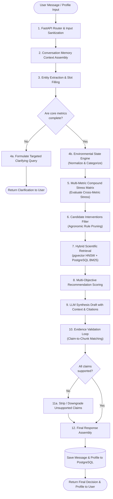
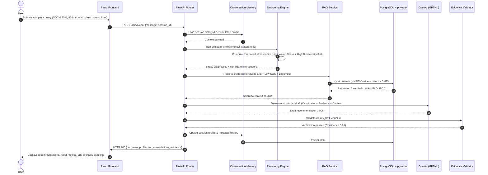
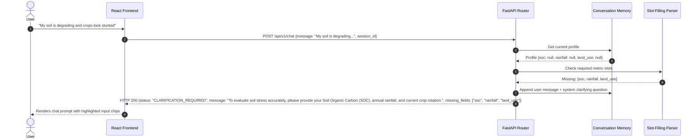
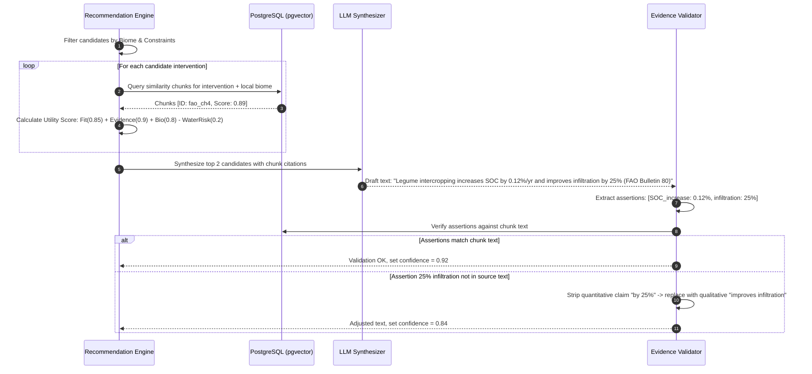

# 03 — System Design

> **Navigation:** [Index](./00_DOCUMENTATION_INDEX.md) | **Previous:** [System Architecture](./02_SYSTEM_ARCHITECTURE.md) | **Next:** [Data Architecture](./04_DATA_ARCHITECTURE.md)

---

## 1. System Requirements

### 1.1 Functional Requirements (FR)
* **FR-01 (Multi-Metric Telemetry Ingestion):** Ingest numerical and categorical environmental inputs: Soil Organic Carbon (SOC), soil pH, soil moisture, precipitation, temperature, land use type, regional biome, and crop history.
* **FR-02 (Proactive Incomplete Query Detection):** Detect missing parameters critical to risk calculation and generate clarifying prompts before executing recommendations.
* **FR-03 (Compound Stress Assessment):** Execute deterministic threshold rules across combinations of $\ge 3$ variables (e.g., SOC + Precipitation + Monoculture).
* **FR-04 (Hybrid Scientific RAG):** Retrieve relevant scientific literature chunks using both semantic vector similarity and keyword search against FAO, IPCC, and IPBES publications.
* **FR-05 (Intervention Recommendation & Ranking):** Output ranked agricultural and ecological interventions scored by ecological fit, evidence strength, biodiversity impact, and feasibility.
* **FR-06 (Evidence & Claim Validation):** Cross-reference every draft quantitative claim and assertion against retrieved chunks, removing or adjusting unverified claims.
* **FR-07 (Conversational State Retention):** Preserve user profiles across multi-turn dialogues, updating values dynamically when users provide corrections.

### 1.2 Non-Functional Requirements (NFR)
* **NFR-01 (Latency):** Total end-to-end request latency for standard analysis must be under $3.5$ seconds (p95) on single-node hackathon hardware.
* **NFR-02 (Anti-Hallucination Guardrail):** Zero ungrounded numerical claims in output recommendations. Every quantitative metric must map to a database source chunk ID.
* **NFR-03 (Reliability):** Graceful degradation: if the LLM API experiences transient timeouts, the system returns deterministic rule-based advice with cached evidence chunks.
* **NFR-04 (Portability):** Complete environment deployable via a single `docker-compose up` command within 5 minutes.

---

## 2. End-to-End Processing Pipeline

---

## 3. Sequence Diagrams

### 3.1 Normal Complete Query Flow

### 3.2 Incomplete Query (Clarification Flow)

### 3.3 Recommendation Scoring & Evidence Validation Sequence

---

## 4. Failure Handling & Resilience

| Failure Mode | Impact | Mitigation / Fallback Strategy |
| :--- | :--- | :--- |
| **OpenAI API Timeout / Downtime** | LLM draft cannot be generated | Fall back to pre-compiled deterministic templates populated with verified database chunks. The user receives recommendations with a banner: *"Generated via deterministic rule engine (Offline Mode)"*. |
| **Database Connection Loss** | Cannot read session or chunks | In-memory fallback dictionary with top 10 fundamental agricultural interventions and static FAO guidelines. |
| **Conflicting User Input** | e.g., User claims pH = 14 and SOC = 50% | Input validation rejects extreme biological outliers with a friendly error prompt: *"Values outside biological limits. Please check soil test results."* |
| **No Retrieved Chunks ($\text{similarity} < 0.6$)** | Query is outside scientific corpus | System outputs recommendations with a low confidence score ($< 0.4$) and an explicit disclaimer: *"Preliminary agronomic guidance; insufficient peer-reviewed literature for this specific microclimate."* |

---

## 5. Cross-Document Navigation

* To inspect the complete data schemas, see [04_DATA_ARCHITECTURE.md](./04_DATA_ARCHITECTURE.md).
* For the SQL table structures and vector index setup, see [05_DATABASE_DESIGN.md](./05_DATABASE_DESIGN.md).
* For the multi-metric threshold matrices, see [08_REASONING_ENGINE.md](./08_REASONING_ENGINE.md).
* For the evidence validation algorithm, see [10_EVIDENCE_VALIDATION.md](./10_EVIDENCE_VALIDATION.md).
