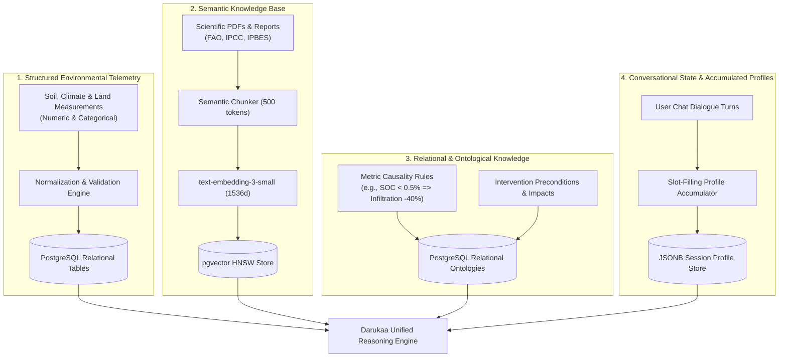
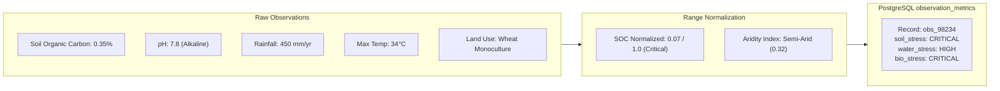
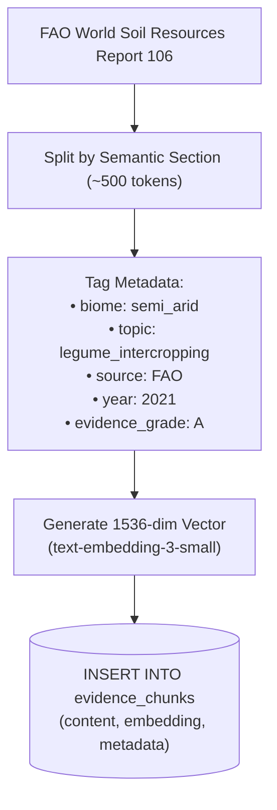
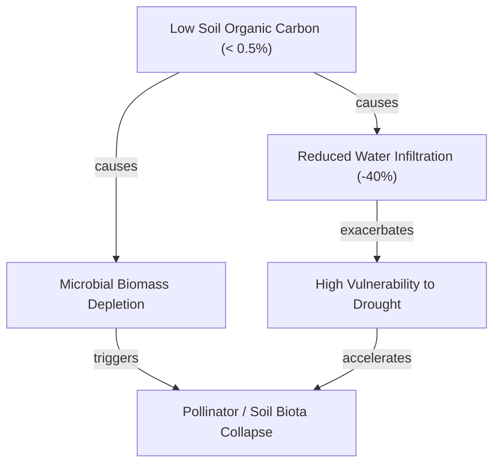
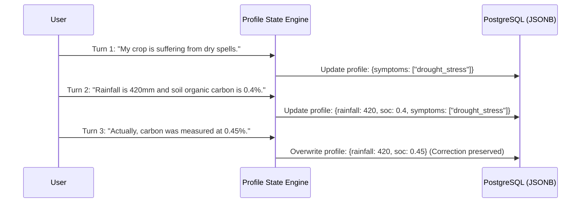

# 04 — Data Architecture

> **Navigation:** [Index](./00_DOCUMENTATION_INDEX.md) | **Previous:** [System Design](./03_SYSTEM_DESIGN.md) | **Next:** [Database Design](./05_DATABASE_DESIGN.md)

---

## 1. Multi-Tiered Data Architecture

Ecological intelligence cannot be realized through unstructured text alone. Biological and agronomic decisions require a synthesis of physical telemetry, relational causality, semantic research papers, and conversational context.

Darukaa.Earth organizes all information into **four distinct data tiers**:



---

## 2. Comparison of Data Tiers

| Tier | Nature | Storage Engine | Query Method | Primary Role in Decision Pipeline |
| :--- | :--- | :--- | :--- | :--- |
| **1. Structured Telemetry** | Quantitative metrics (SOC %, pH, rainfall mm, temperature °C) | PostgreSQL columns / JSONB | SQL comparison operators (`<`, `>`, `BETWEEN`) | Grounding the current physical state of the land |
| **2. Semantic Knowledge** | Unstructured scientific prose, field trial results, regional guidelines | `pgvector` table (`vector(1536)`) | Cosine distance (`<=>`) + BM25 keyword search | Providing scientific literature citations and experimental proof |
| **3. Relational Ontology** | Cause-and-effect rules, inter-metric correlations, constraint matrices | PostgreSQL relational tables | SQL JOINs & foreign keys | Deterministically identifying compound stress and filtering candidates |
| **4. Conversational State** | Multi-turn chat messages, accumulated profile, user corrections | PostgreSQL relational + JSONB | Primary key session lookup | Maintaining context across turns without repeating questions |

---

## 3. Deep Dive into Data Tiers

### 3.1 Tier 1: Structured Environmental Telemetry

Structured data represents the empirical physical conditions of the landscape under evaluation.



Key fields stored:
* **Soil Physics:** Soil Organic Carbon (`soc_percent`), pH (`ph_level`), Soil Moisture (`moisture_percent`), Bulk Density (`bulk_density_g_cm3`).
* **Climate Indicators:** Annual Rainfall (`annual_rainfall_mm`), Mean Temp (`mean_temp_celsius`), Maximum Summer Temp (`max_temp_celsius`), Drought Months (`dry_months_count`).
* **Land & Ecology:** Current Land Use (`cropland_monoculture`, `pasture`, `agroforestry`), Canopy Cover (`canopy_cover_percent`), Field Margin Vegetation (`margin_veg_present`).

---

### 3.2 Tier 2: Semantic Scientific Knowledge

The semantic tier indexes peer-reviewed consensus and institutional field guides.



Metadata schema attached to every semantic chunk:
```json
{
  "source_id": "fao_soil_bulletin_80",
  "source_title": "Soil Management for Sustainable Agriculture",
  "organization": "FAO",
  "year": 2020,
  "doi": "10.4060/ca9280en",
  "authority_tier": 1,
  "biome": "semi-arid",
  "target_metrics": ["soc", "soil_moisture", "nitrogen"],
  "recommended_interventions": ["legume_intercropping", "conservation_tillage"]
}
```

---

### 3.3 Tier 3: Relationship & Causality Knowledge

Rather than relying on an LLM to guess the laws of soil physics, Darukaa.Earth encodes validated agronomic causality directly into a relational relationship matrix.



Database representation in table `metric_relationships`:
* `source_metric`: `soc_percent`
* `operator`: `<`
* `threshold_value`: `0.5`
* `affected_metric`: `water_infiltration_capacity`
* `effect_direction`: `NEGATIVE`
* `impact_factor`: `0.40`
* `scientific_justification`: `"Loss of organic matter destroys aggregate stability, reducing infiltration pores (IPCC SRCCL, 2019)."`

---

### 3.4 Tier 4: Conversational State & Accumulated Profiles

Maintains conversational continuity and dynamic slot-filling across multiple conversational turns.



---

## 4. Cross-Document Navigation

* To see the concrete DDL implementation and indexing strategies, see [05_DATABASE_DESIGN.md](./05_DATABASE_DESIGN.md).
* For the institutional sources populating Tier 2, see [06_KNOWLEDGE_BASE.md](./06_KNOWLEDGE_BASE.md).
* For the hybrid retrieval pipeline operating on Tier 2, see [07_RAG_ARCHITECTURE.md](./07_RAG_ARCHITECTURE.md).
* To see how Tier 1 and Tier 3 drive deterministic calculations, see [08_REASONING_ENGINE.md](./08_REASONING_ENGINE.md).
