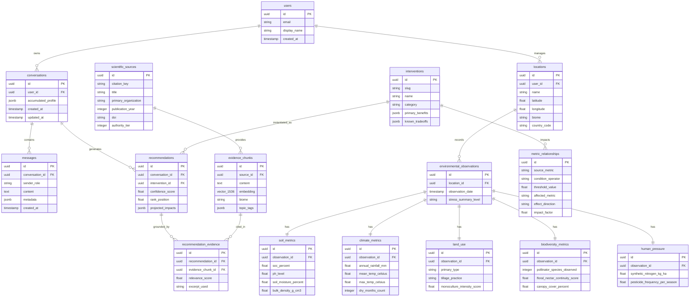

# 05 — Database Design

> **Navigation:** [Index](./00_DOCUMENTATION_INDEX.md) | **Previous:** [Data Architecture](./04_DATA_ARCHITECTURE.md) | **Next:** [Knowledge Base](./06_KNOWLEDGE_BASE.md)

---

## 1. Overview & Storage Strategy

Darukaa.Earth utilizes a unified **PostgreSQL 16** database with the **`pgvector`** extension. This eliminates the operational complexity of syncing external vector stores (e.g., Pinecone, Milvus) with relational user data during a 24-hour hackathon, providing strict ACID guarantees, unified backups, and atomic transactions.

---

## 2. Entity-Relationship Diagram (ERD)



---

## 3. PostgreSQL 16 DDL & Schema Definition

```sql
-- 1. Enable Required Extensions
CREATE EXTENSION IF NOT EXISTS "uuid-ossp";
CREATE EXTENSION IF NOT EXISTS "vector";

-- 2. User & Session Tables
CREATE TABLE users (
    id UUID PRIMARY KEY DEFAULT uuid_generate_v4(),
    email VARCHAR(255) UNIQUE NOT NULL,
    display_name VARCHAR(100),
    created_at TIMESTAMPTZ DEFAULT CURRENT_TIMESTAMP
);

CREATE TABLE conversations (
    id UUID PRIMARY KEY DEFAULT uuid_generate_v4(),
    user_id UUID REFERENCES users(id) ON DELETE SET NULL,
    accumulated_profile JSONB DEFAULT '{}'::jsonb,
    created_at TIMESTAMPTZ DEFAULT CURRENT_TIMESTAMP,
    updated_at TIMESTAMPTZ DEFAULT CURRENT_TIMESTAMP
);

CREATE TABLE messages (
    id UUID PRIMARY KEY DEFAULT uuid_generate_v4(),
    conversation_id UUID NOT NULL REFERENCES conversations(id) ON DELETE CASCADE,
    sender_role VARCHAR(20) NOT NULL CHECK (sender_role IN ('user', 'assistant', 'system')),
    content TEXT NOT NULL,
    metadata JSONB DEFAULT '{}'::jsonb,
    created_at TIMESTAMPTZ DEFAULT CURRENT_TIMESTAMP
);

-- 3. Location & Structured Observation Tables
CREATE TABLE locations (
    id UUID PRIMARY KEY DEFAULT uuid_generate_v4(),
    user_id UUID REFERENCES users(id) ON DELETE CASCADE,
    name VARCHAR(120) NOT NULL,
    latitude DECIMAL(9, 6),
    longitude DECIMAL(9, 6),
    biome VARCHAR(50) NOT NULL, -- e.g. 'semi_arid', 'temperate_grassland'
    country_code CHAR(2) DEFAULT 'US'
);

CREATE TABLE environmental_observations (
    id UUID PRIMARY KEY DEFAULT uuid_generate_v4(),
    location_id UUID REFERENCES locations(id) ON DELETE CASCADE,
    observation_date DATE NOT NULL DEFAULT CURRENT_DATE,
    stress_summary_level VARCHAR(20) DEFAULT 'MODERATE' CHECK (stress_summary_level IN ('LOW', 'MODERATE', 'HIGH', 'CRITICAL'))
);

CREATE TABLE soil_metrics (
    id UUID PRIMARY KEY DEFAULT uuid_generate_v4(),
    observation_id UUID NOT NULL REFERENCES environmental_observations(id) ON DELETE CASCADE,
    soc_percent DECIMAL(4, 2) NOT NULL CHECK (soc_percent >= 0 AND soc_percent <= 20),
    ph_level DECIMAL(3, 1) NOT NULL CHECK (ph_level >= 3.0 AND ph_level <= 11.0),
    soil_moisture_percent DECIMAL(4, 1),
    bulk_density_g_cm3 DECIMAL(3, 2)
);

CREATE TABLE climate_metrics (
    id UUID PRIMARY KEY DEFAULT uuid_generate_v4(),
    observation_id UUID NOT NULL REFERENCES environmental_observations(id) ON DELETE CASCADE,
    annual_rainfall_mm DECIMAL(6, 1) NOT NULL CHECK (annual_rainfall_mm >= 0),
    mean_temp_celsius DECIMAL(4, 1),
    max_temp_celsius DECIMAL(4, 1),
    dry_months_count SMALLINT CHECK (dry_months_count BETWEEN 0 AND 12)
);

CREATE TABLE land_use (
    id UUID PRIMARY KEY DEFAULT uuid_generate_v4(),
    observation_id UUID NOT NULL REFERENCES environmental_observations(id) ON DELETE CASCADE,
    primary_type VARCHAR(50) NOT NULL, -- 'cropland_monoculture', 'pasture', 'agroforestry'
    tillage_practice VARCHAR(50) DEFAULT 'conventional',
    monoculture_intensity_score DECIMAL(3, 2) DEFAULT 1.0 -- 0.0 (Diverse) to 1.0 (Strict monoculture)
);

CREATE TABLE biodiversity_metrics (
    id UUID PRIMARY KEY DEFAULT uuid_generate_v4(),
    observation_id UUID NOT NULL REFERENCES environmental_observations(id) ON DELETE CASCADE,
    pollinator_species_observed INTEGER DEFAULT 0,
    floral_nectar_continuity_score DECIMAL(3, 2) DEFAULT 0.0,
    canopy_cover_percent DECIMAL(4, 1) DEFAULT 0.0
);

CREATE TABLE human_pressure (
    id UUID PRIMARY KEY DEFAULT uuid_generate_v4(),
    observation_id UUID NOT NULL REFERENCES environmental_observations(id) ON DELETE CASCADE,
    synthetic_nitrogen_kg_ha DECIMAL(5, 1) DEFAULT 0.0,
    pesticide_frequency_per_season INTEGER DEFAULT 0
);

-- 4. Scientific Literature & RAG Tables
CREATE TABLE scientific_sources (
    id UUID PRIMARY KEY DEFAULT uuid_generate_v4(),
    citation_key VARCHAR(50) UNIQUE NOT NULL, -- e.g., 'fao_soil_bulletin_80'
    title VARCHAR(300) NOT NULL,
    primary_organization VARCHAR(100) NOT NULL, -- 'FAO', 'IPCC', 'IPBES'
    publication_year INTEGER NOT NULL,
    doi VARCHAR(100),
    authority_tier SMALLINT NOT NULL CHECK (authority_tier BETWEEN 1 AND 3)
);

CREATE TABLE evidence_chunks (
    id UUID PRIMARY KEY DEFAULT uuid_generate_v4(),
    source_id UUID NOT NULL REFERENCES scientific_sources(id) ON DELETE CASCADE,
    content TEXT NOT NULL,
    embedding vector(1536) NOT NULL,
    biome VARCHAR(50),
    topic_tags JSONB DEFAULT '[]'::jsonb,
    tsv tsvector GENERATED ALWAYS AS (to_tsvector('english', content)) STORED
);

-- 5. Interventions, Rules & Recommendations
CREATE TABLE interventions (
    id UUID PRIMARY KEY DEFAULT uuid_generate_v4(),
    slug VARCHAR(60) UNIQUE NOT NULL,
    name VARCHAR(120) NOT NULL,
    category VARCHAR(50) NOT NULL, -- 'soil_enhancement', 'water_conservation', 'biodiversity_strip'
    primary_benefits JSONB NOT NULL,
    known_tradeoffs JSONB NOT NULL
);

CREATE TABLE metric_relationships (
    id UUID PRIMARY KEY DEFAULT uuid_generate_v4(),
    source_metric VARCHAR(50) NOT NULL,
    condition_operator VARCHAR(5) NOT NULL, -- '<', '>', '<='
    threshold_value DECIMAL(8, 2) NOT NULL,
    affected_metric VARCHAR(50) NOT NULL,
    effect_direction VARCHAR(10) NOT NULL, -- 'POSITIVE', 'NEGATIVE'
    impact_factor DECIMAL(4, 2) NOT NULL,
    scientific_rationale TEXT
);

CREATE TABLE recommendations (
    id UUID PRIMARY KEY DEFAULT uuid_generate_v4(),
    conversation_id UUID NOT NULL REFERENCES conversations(id) ON DELETE CASCADE,
    intervention_id UUID NOT NULL REFERENCES interventions(id) ON DELETE CASCADE,
    confidence_score DECIMAL(3, 2) NOT NULL CHECK (confidence_score BETWEEN 0.0 AND 1.0),
    rank_position SMALLINT NOT NULL,
    projected_impacts JSONB NOT NULL,
    created_at TIMESTAMPTZ DEFAULT CURRENT_TIMESTAMP
);

CREATE TABLE recommendation_evidence (
    id UUID PRIMARY KEY DEFAULT uuid_generate_v4(),
    recommendation_id UUID NOT NULL REFERENCES recommendations(id) ON DELETE CASCADE,
    evidence_chunk_id UUID NOT NULL REFERENCES evidence_chunks(id) ON DELETE CASCADE,
    relevance_score DECIMAL(3, 2),
    excerpt_used TEXT NOT NULL
);
```

---

## 4. Indexing & Optimization Strategy

```sql
-- 1. pgvector HNSW Index for ultra-fast semantic similarity (< 15ms)
CREATE INDEX idx_evidence_chunks_hnsw 
ON evidence_chunks 
USING hnsw (embedding vector_cosine_ops)
WITH (m = 16, ef_construction = 64);

-- 2. PostgreSQL Full-Text Search Index (BM25 Hybrid retrieval)
CREATE INDEX idx_evidence_chunks_tsv ON evidence_chunks USING gin(tsv);

-- 3. Fast relational and session filtering indexes
CREATE INDEX idx_messages_conv_created ON messages(conversation_id, created_at ASC);
CREATE INDEX idx_conversations_user ON conversations(user_id);
CREATE INDEX idx_evidence_chunks_biome ON evidence_chunks(biome);
CREATE INDEX idx_recs_conversation ON recommendations(conversation_id);
CREATE INDEX idx_obs_location ON environmental_observations(location_id);
```

---

## 5. Seed Data Sample

```sql
-- Insert Core Scientific Source
INSERT INTO scientific_sources (citation_key, title, primary_organization, publication_year, doi, authority_tier)
VALUES 
('fao_soil_bulletin_80', 'Soil Management for Sustainable Agriculture', 'FAO', 2020, '10.4060/ca9280en', 1),
('ipcc_srccl_ch4', 'Climate Change and Land: Chapter 4 Land Degradation', 'IPCC', 2019, '10.1017/9781009157988.006', 1);

-- Insert Core Interventions
INSERT INTO interventions (slug, name, category, primary_benefits, known_tradeoffs)
VALUES 
('legume_intercropping', 'Legume Intercropping (Chickpea / Vetch)', 'soil_enhancement', 
 '{"soc_increase_yr": 0.12, "nitrogen_fixation_kg_ha": 45, "pollinator_support": "MODERATE"}'::jsonb,
 '{"moisture_competition_risk": "MEDIUM", "establishment_cost": "LOW"}'::jsonb),
('native_hedgerow_strips', 'Native Biodiversity Hedgerow Buffers', 'biodiversity_strip',
 '{"pollinator_increase_pct": 35, "wind_erosion_reduction_pct": 20}'::jsonb,
 '{"land_taken_out_of_production_pct": 4}'::jsonb);

-- Insert Deterministic Metric Relationship Rule
INSERT INTO metric_relationships (source_metric, condition_operator, threshold_value, affected_metric, effect_direction, impact_factor, scientific_rationale)
VALUES 
('soc_percent', '<', 0.5, 'water_retention_capacity', 'NEGATIVE', 0.40, 'Degraded organic matter collapses micropore structure, diminishing available water capacity.'),
('annual_rainfall_mm', '<', 500, 'cover_crop_moisture_risk', 'POSITIVE', 0.65, 'In semi-arid regimes, high-biomass cover crops deplete residual moisture required by cash crops.');
```

---

## 6. Cross-Document Navigation

* To understand the scientific corpus structure populating `scientific_sources`, see [06_KNOWLEDGE_BASE.md](./06_KNOWLEDGE_BASE.md).
* For the hybrid retrieval query executing on `evidence_chunks`, see [07_RAG_ARCHITECTURE.md](./07_RAG_ARCHITECTURE.md).
* For how the reasoning engine queries `metric_relationships`, see [08_REASONING_ENGINE.md](./08_REASONING_ENGINE.md).
