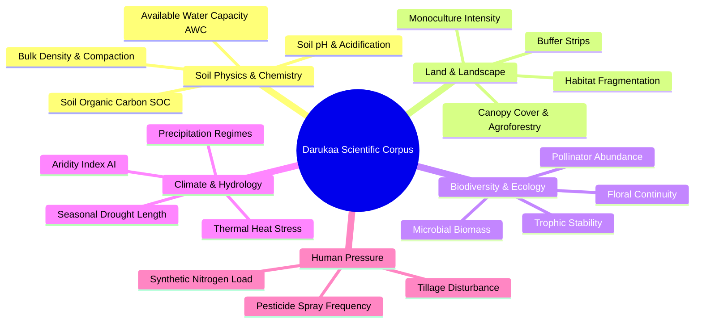
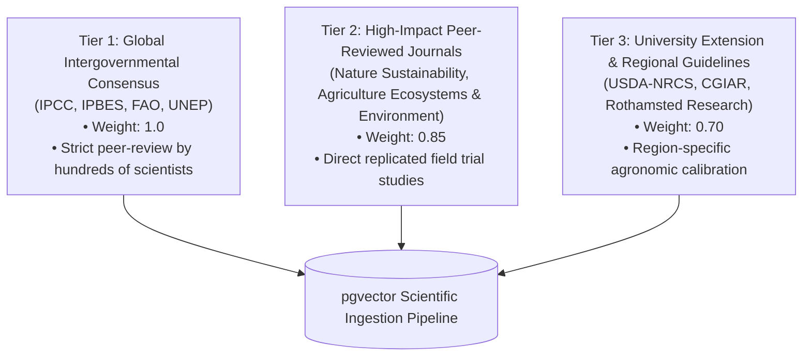

# 06 — Knowledge Base & Scientific Corpus

> **Navigation:** [Index](./00_DOCUMENTATION_INDEX.md) | **Previous:** [Database Design](./05_DATABASE_DESIGN.md) | **Next:** [RAG Architecture](./07_RAG_ARCHITECTURE.md)

---

## 1. Scientific Domain Taxonomies

Darukaa.Earth covers five foundational environmental domains. Every domain defines baseline metric bounds, degradation indicators, and authoritative measurement scales.



---

## 2. Quantitative Metric Standards & Thresholds

| Domain | Metric | Units | Healthy Range | Critical Degradation Threshold | Primary Reference Standard |
| :--- | :--- | :--- | :--- | :--- | :--- |
| **Soil** | Soil Organic Carbon (SOC) | % dry soil weight | $1.5\% - 4.0\%$ | $< 0.5\%$ | FAO World Soil Charter (2015) |
| **Soil** | Soil pH | $-\log[H^+]$ | $6.0 - 7.5$ | $< 5.2$ (Acidic) or $> 8.4$ (Sodic) | USDA NRCS Soil Quality Indicators |
| **Climate** | Annual Rainfall | mm / year | Variable by biome | $< 400\text{ mm}$ (Semi-Arid Aridity Index $< 0.40$) | UNEP Aridity Classification |
| **Climate** | Max Summer Temp | °C | $20 - 28^\circ\text{C}$ | $> 35^\circ\text{C}$ for $> 14$ consecutive days | IPCC WGI AR6 (2021) |
| **Land** | Monoculture Extent | % single crop area | $< 40\%$ | $> 85\%$ continuous single genus | IPBES Global Assessment (2019) |
| **Biodiversity**| Pollinator Continuity | Index $(0.0 - 1.0)$ | $> 0.60$ | $< 0.20$ (No floral resources outside crop bloom) | FAO Pollinator Assessment (2018) |

---

## 3. Scientific Source Authority Hierarchy

To guarantee that generated recommendations are legally and ecologically defensible, all corpus ingestion follows a strict 3-tier hierarchy.



### Ingestion Source Catalog (Seed Corpus)
1. **FAO (Food and Agriculture Organization):**
   * *Recarbonizing Global Soils: A technical manual of recommended management practices* (Vols 1–6, 2021).
   * *Soil Management for Sustainable Agriculture* (Bulletin 80, 2020).
   * *Pollinators: The importance of wild bees in agricultural landscapes* (2018).
2. **IPCC (Intergovernmental Panel on Climate Change):**
   * *Special Report on Climate Change and Land (SRCCL): Chapter 4 Land Degradation* (2019).
   * *Climate Change 2022: Mitigation of Climate Change (WGIII), Agriculture, Forestry and Other Land Uses (AFOLU)*.
3. **IPBES (Intergovernmental Science-Policy Platform on Biodiversity and Ecosystem Services):**
   * *The Assessment Report on Land Degradation and Restoration* (2018).
   * *The Assessment Report on Pollinators, Pollination and Food Production* (2016).

---

## 4. Chunk Metadata Schema & Quality Standards

Every document ingested into the knowledge base must conform to the following schema:

```json
{
  "chunk_id": "chunk_fao_recarb_v2_p142",
  "source_id": "fao_recarb_2021",
  "citation_key": "FAO (2021)",
  "title": "Recarbonizing Global Soils - Volume 2: Cropland Management Practices",
  "organization": "FAO",
  "publication_year": 2021,
  "authority_tier": 1,
  "biome_applicability": ["semi_arid", "mediterranean", "temperate_steppe"],
  "target_soil_types": ["aridisol", "entisol", "mollisol"],
  "metric_focus": ["soc_percent", "water_infiltration", "crop_yield"],
  "intervention_slug": "legume_intercropping",
  "quantitative_assertions": [
    {
      "metric": "soc_accumulation_rate",
      "value_range": "0.10 - 0.25 % / year",
      "conditions": "Semi-arid rotation with chickpeas or field peas under zero tillage"
    }
  ],
  "license": "CC-BY-3.0-IGO"
}
```

---

## 5. Strict Scientific Integrity Rules

> [!CAUTION]
> **Zero Tolerance for Hallucinated Science:**
> 1. **No Invented Numbers:** The AI engine is strictly prohibited from generating quantitative values (e.g., *"Increases soil carbon by 35%"*) unless that exact numeric assertion exists in the retrieved chunk metadata.
> 2. **No Phantom Citations:** Citing *"Smith et al. 2022"* when no such record exists in `scientific_sources` triggers an automated validation rejection.
> 3. **Conflicting Studies Handling:** Where studies diverge (e.g., cover crop water depletion in drought years vs organic matter gain), the engine must present both sides as an explicit **Trade-Off Matrix** rather than picking an arbitrary winner.

---

## 6. Cross-Document Navigation

* To see how this corpus is embedded and indexed, see [07_RAG_ARCHITECTURE.md](./07_RAG_ARCHITECTURE.md).
* For the mathematical reasoning rules operating on these metrics, see [08_REASONING_ENGINE.md](./08_REASONING_ENGINE.md).
* For the post-generation claim verification engine, see [10_EVIDENCE_VALIDATION.md](./10_EVIDENCE_VALIDATION.md).
