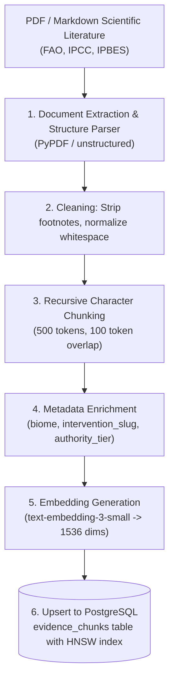
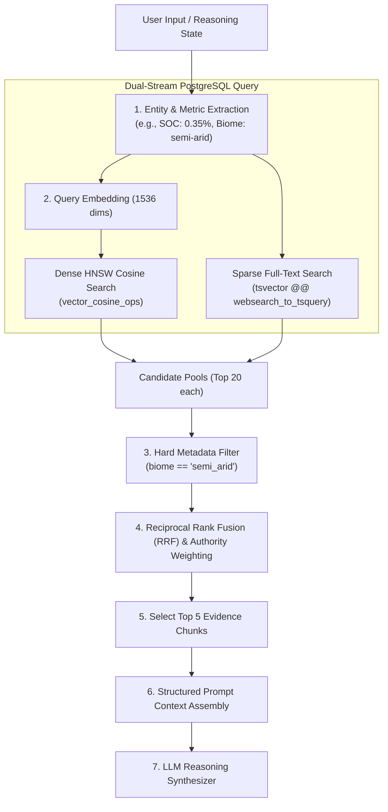

# 07 — RAG Architecture & Retrieval Pipeline

> **Navigation:** [Index](./00_DOCUMENTATION_INDEX.md) | **Previous:** [Knowledge Base](./06_KNOWLEDGE_BASE.md) | **Next:** [Reasoning Engine](./08_REASONING_ENGINE.md)

---

## 1. Overview & Architectural Philosophy

Darukaa.Earth does not employ naive "top-$k$" semantic search. Because ecological decisions carry real agronomic and financial consequences, retrieval must be **hybrid, metadata-filtered, and authority-weighted**.

The pipeline combines:
1. **Dense Semantic Retrieval:** `pgvector` HNSW index using OpenAI `text-embedding-3-small`.
2. **Sparse Keyword Retrieval:** PostgreSQL `tsvector` with BM25-style lexical ranking.
3. **Hard Metadata Filtering:** Restricting search space by regional biome (e.g., `semi_arid`) and soil taxonomy.
4. **Reciprocal Rank Fusion (RRF):** Merging dense and sparse ranks with institutional authority weights.

---

## 2. Ingestion Pipeline



---

## 3. Query Retrieval Pipeline



---

## 4. Hybrid Retrieval & RRF Algorithm (Python Pseudocode)

```python
import psycopg2
from typing import List, Dict, Any

def hybrid_retrieve(
    query_text: str, 
    query_vector: List[float], 
    biome: str, 
    top_k: int = 5,
    db_conn = None
) -> List[Dict[str, Any]]:
    """
    Executes hybrid retrieval combining pgvector cosine distance 
    and PostgreSQL full-text search with Reciprocal Rank Fusion (RRF).
    """
    k_constant = 60  # Standard RRF constant
    
    sql = """
    WITH semantic_search AS (
        SELECT id, source_id, content, authority_tier,
               ROW_NUMBER() OVER (ORDER BY embedding <=> %s::vector) AS dense_rank
        FROM evidence_chunks
        JOIN scientific_sources ON evidence_chunks.source_id = scientific_sources.id
        WHERE biome = %s OR biome IS NULL
        LIMIT 25
    ),
    keyword_search AS (
        SELECT id, source_id, content, authority_tier,
               ROW_NUMBER() OVER (ORDER BY ts_rank(tsv, websearch_to_tsquery('english', %s)) DESC) AS sparse_rank
        FROM evidence_chunks
        JOIN scientific_sources ON evidence_chunks.source_id = scientific_sources.id
        WHERE tsv @@ websearch_to_tsquery('english', %s)
          AND (biome = %s OR biome IS NULL)
        LIMIT 25
    )
    SELECT 
        COALESCE(s.id, k.id) AS chunk_id,
        COALESCE(s.content, k.content) AS content,
        COALESCE(s.authority_tier, k.authority_tier) AS authority_tier,
        (
            COALESCE(1.0 / (%s + s.dense_rank), 0.0) +
            COALESCE(1.0 / (%s + k.sparse_rank), 0.0)
        ) * CASE 
            WHEN COALESCE(s.authority_tier, k.authority_tier) = 1 THEN 1.25 -- Tier 1 Boost (IPCC/FAO)
            WHEN COALESCE(s.authority_tier, k.authority_tier) = 2 THEN 1.00
            ELSE 0.85
        END AS rrf_score
    FROM semantic_search s
    FULL OUTER JOIN keyword_search k ON s.id = k.id
    ORDER BY rrf_score DESC
    LIMIT %s;
    """
    with db_conn.cursor() as cur:
        cur.execute(sql, (query_vector, biome, query_text, query_text, biome, k_constant, k_constant, top_k))
        results = cur.fetchall()
        
    return [
        {"chunk_id": r[0], "content": r[1], "authority_tier": r[2], "rrf_score": float(r[3])}
        for r in results
    ]
```

---

## 5. Structured Context Assembly Prompt

When presenting retrieved chunks to the LLM, chunks are injected with strict boundary fences and unique citation tokens:

```text
[SYSTEM INSTRUCTION]
You are the Darukaa.Earth Environmental Science Intelligence Synthesizer.
Evaluate the user's environmental conditions using the verified scientific chunks provided below.

RULES:
1. Cite evidence using the token [CHUNK: <chunk_id>].
2. NEVER state any numerical benefit or rate unless it is explicitly present in a cited chunk.
3. Clearly detail trade-offs (e.g., moisture competition, establishment cost).

[VERIFIED SCIENTIFIC EVIDENCE]
---
CHUNK_ID: fao_soil_bulletin_80_p42
SOURCE: FAO Soil Bulletin 80 (2020) | Authority: Tier 1
BIOME: Semi-Arid Cropland
CONTENT: "In semi-arid Mediterranean zones, legume intercropping (specifically Cicer arietinum with cereals) has demonstrated an average soil organic carbon increase of 0.12% per year over a 5-year monitoring period, while reducing required synthetic nitrogen inputs by 40 kg N/ha. However, in regions with annual precipitation under 450 mm, competition for early season subsoil moisture can reduce cereal grain filling by 5-8% during severe spring droughts."
---
CHUNK_ID: ipcc_srccl_ch4_p118
SOURCE: IPCC Climate Change and Land (2019) | Authority: Tier 1
BIOME: Dryland
CONTENT: "Conservation tillage paired with crop diversification enhances soil aggregate stability and biological activity. Adoption of perennial vegetative buffer strips on field perimeters increases wild pollinator visitation by 30-45% within two crop cycles."
---

[USER ENVIRONMENTAL STATE]
SOC: 0.35% (CRITICAL) | Rainfall: 450 mm/yr (SEMI-ARID) | Land Use: Wheat Monoculture (CRITICAL BIODIVERSITY RISK)
```

---

## 6. Cross-Document Navigation

* To inspect the scientific literature corpus being chunked, see [06_KNOWLEDGE_BASE.md](./06_KNOWLEDGE_BASE.md).
* To see how retrieved chunks feed the multi-metric engine, see [08_REASONING_ENGINE.md](./08_REASONING_ENGINE.md).
* For the claim-to-chunk fact verification algorithm, see [10_EVIDENCE_VALIDATION.md](./10_EVIDENCE_VALIDATION.md).
