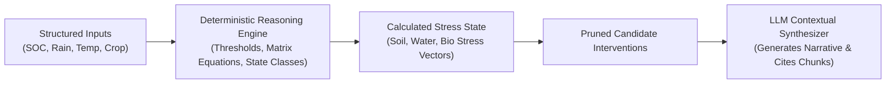
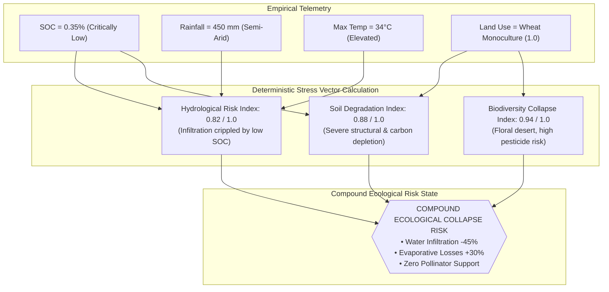
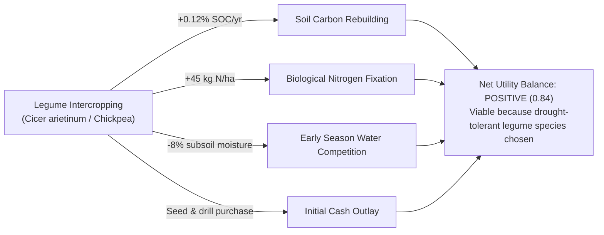

# 08 — Multi-Metric Reasoning Engine

> **Navigation:** [Index](./00_DOCUMENTATION_INDEX.md) | **Previous:** [RAG Architecture](./07_RAG_ARCHITECTURE.md) | **Next:** [Recommendation Engine](./09_RECOMMENDATION_ENGINE.md)

---

## 1. Core Architectural Principle

> [!IMPORTANT]
> **The LLM does NOT invent the ecological reasoning.**
> In Darukaa.Earth, the assessment of environmental risk and compound stress is computed by a **deterministic Python state machine** based on agronomic thresholds and causal relational graph equations. The LLM's role is strictly confined to contextual synthesis, scientific summarization, and human-readable narrative generation.



---

## 2. Multi-Metric Compound Stress Formulation

Single metrics are deceptive. A soil with low organic carbon ($0.4\%$) in a region with $1200\text{ mm}$ of rainfall behaves completely differently than the same soil in an arid zone with $450\text{ mm}$ of rainfall under continuous monoculture wheat.

Darukaa.Earth evaluates compound stress across 4 simultaneous dimensions:
1. **Soil Health Index ($S_{\text{soil}}$):** Derived from SOC, pH deviation, and bulk density.
2. **Hydrological Vulnerability ($S_{\text{water}}$):** Derived from rainfall, aridity index, and soil water retention capacity.
3. **Biodiversity & Ecosystem Stability ($S_{\text{bio}}$):** Derived from monoculture intensity, floral continuity, and pesticide frequency.
4. **Thermal / Climatic Stress ($S_{\text{clim}}$):** Derived from max summer temperatures and drought duration.



---

## 3. Threshold Matrix & Mathematical Definitions

### 3.1 Normalization Functions

#### Soil Organic Carbon Stress ($s_{\text{soc}} \in [0, 1]$):
$$s_{\text{soc}} = \max\left(0.0, \min\left(1.0, \frac{2.0 - \text{SOC}}{2.0 - 0.5}\right)\right)$$
*If $\text{SOC} \le 0.5\%$, $s_{\text{soc}} = 1.0$ (Critical).*

#### Hydrological Water Stress ($s_{\text{water}} \in [0, 1]$):
$$s_{\text{water}} = \max\left(0.0, \min\left(1.0, \frac{800 - \text{Rainfall}}{800 - 350}\right)\right)$$
*If $\text{Rainfall} \le 350\text{ mm}$, $s_{\text{water}} = 1.0$ (Severe Aridity).*

#### Monoculture Stress ($s_{\text{mono}} \in [0, 1]$):
$$s_{\text{mono}} = \text{monoculture\_intensity\_score} \in [0.0, 1.0]$$

### 3.2 Compound Stress Multiplier (Synergistic Coupling)

Ecological stress is non-linear. When poor soil carbon collides with low rainfall and monoculture, degradation accelerates synergistically:

$$\text{CompoundRisk} = \min\left(1.0, \; \sqrt{s_{\text{soc}} \cdot s_{\text{water}}} \times (1.0 + 0.5 \cdot s_{\text{mono}})\right)$$

| $\text{SOC}$ | Rainfall | Crop Pattern | $s_{\text{soc}}$ | $s_{\text{water}}$ | $s_{\text{mono}}$ | Compound Risk Score | Qualitative Assessment |
| :--- | :--- | :--- | :--- | :--- | :--- | :--- | :--- |
| **0.35%** | 450 mm | Wheat Monoculture | **1.00** | **0.78** | **1.00** | **1.00** | **CRITICAL COMPOUND COLLAPSE** |
| **0.35%** | 1100 mm | Wheat Monoculture | **1.00** | **0.00** | **1.00** | **0.00** | High Carbon Depletion (Water buffered) |
| **2.20%** | 450 mm | Wheat Monoculture | **0.00** | **0.78** | **1.00** | **0.00** | Water Stress (High organic sponge buffers) |
| **2.50%** | 850 mm | Diverse Rotation | **0.00** | **0.00** | **0.00** | **0.00** | **HEALTHY RESILIENT AGROECOSYSTEM** |

---

## 4. Deterministic Reasoning Engine (Python Implementation)

```python
from dataclasses import dataclass
from typing import Dict, List, Any

@dataclass
class EnvironmentalState:
    soc_percent: float
    annual_rainfall_mm: float
    max_temp_celsius: float
    monoculture_score: float  # 0.0 to 1.0
    soil_ph: float

@dataclass
class AssessmentResult:
    soil_stress: float
    water_stress: float
    biodiversity_stress: float
    compound_risk: float
    risk_level: str
    diagnostics: List[str]
    allowed_intervention_tags: List[str]
    forbidden_intervention_tags: List[str]

class MultiMetricReasoningEngine:
    def evaluate(self, state: EnvironmentalState) -> AssessmentResult:
        diagnostics = []
        allowed = []
        forbidden = []

        # 1. Normalize individual stress vectors
        s_soc = max(0.0, min(1.0, (2.0 - state.soc_percent) / (2.0 - 0.5)))
        s_water = max(0.0, min(1.0, (800.0 - state.annual_rainfall_mm) / (800.0 - 350.0)))
        s_bio = state.monoculture_score

        # 2. Synergistic compound risk
        import math
        synergy_product = math.sqrt(s_soc * s_water)
        compound_risk = min(1.0, synergy_product * (1.0 + 0.5 * s_bio))

        # 3. Deterministic Diagnostic Rules
        if s_soc >= 0.8:
            diagnostics.append("Severe Soil Organic Carbon exhaustion (<0.5% threshold breach). Structural aggregate collapse imminent.")
            allowed.append("carbon_building")
        
        if s_water >= 0.7:
            diagnostics.append("High hydrological water deficit. Low precipitation limits biomass potential.")
            # Critical constraint: prohibit water-guzzling cover crops in semi-arid zones!
            forbidden.append("high_water_demand_cover_crop")
            allowed.append("drought_tolerant_legume")
        else:
            allowed.append("high_water_demand_cover_crop")

        if s_bio >= 0.75:
            diagnostics.append("Monoculture floral desert. Wild pollinator presence collapsed due to lack of seasonal nectar bridges.")
            allowed.append("pollinator_buffer_strip")

        # 4. Qualitative classification
        if compound_risk >= 0.80:
            risk_level = "CRITICAL"
            diagnostics.append("Compound multi-variable risk: Soil degradation and water deficit mutually reinforce desertification.")
        elif compound_risk >= 0.50:
            risk_level = "HIGH"
        elif compound_risk >= 0.25:
            risk_level = "MODERATE"
        else:
            risk_level = "LOW"

        return AssessmentResult(
            soil_stress=round(s_soc, 2),
            water_stress=round(s_water, 2),
            biodiversity_stress=round(s_bio, 2),
            compound_risk=round(compound_risk, 2),
            risk_level=risk_level,
            diagnostics=diagnostics,
            allowed_intervention_tags=allowed,
            forbidden_intervention_tags=forbidden
        )
```

---

## 5. Trade-Off Analysis & Contradiction Resolution

A critical failure of naive AI models is recommending interventions that solve one metric while devastating another (e.g., advising a dense clover cover crop to rebuild carbon, which drains the remaining 400mm subsoil water and ruins the cash crop).

Darukaa.Earth enforces an explicit **Ecological Trade-Off Matrix**:



---

## 6. Cross-Document Navigation

* To see how these computed stress vectors feed intervention rankings, see [09_RECOMMENDATION_ENGINE.md](./09_RECOMMENDATION_ENGINE.md).
* For the fact-checking loop that verifies narrative outputs, see [10_EVIDENCE_VALIDATION.md](./10_EVIDENCE_VALIDATION.md).
* To see how API clients consume these calculated stress metrics, see [12_API_DESIGN.md](./12_API_DESIGN.md).
