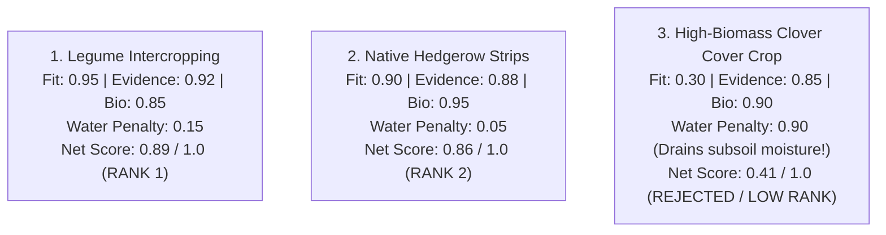

# 09 — Recommendation Engine & Intervention Ranking

> **Navigation:** [Index](./00_DOCUMENTATION_INDEX.md) | **Previous:** [Reasoning Engine](./08_REASONING_ENGINE.md) | **Next:** [Evidence Validation](./10_EVIDENCE_VALIDATION.md)

---

## 1. Overview & Intervention Catalogue

The Darukaa.Earth Recommendation Engine translates diagnosed multi-metric stress vectors into concrete, actionable, and ranked ecological interventions.

### Supported Interventions (MVP Catalogue)
1. **Legume Intercropping (*Cicer arietinum* / Chickpea, *Vicia sativa* / Vetch):** Nitrogen fixation and carbon input with minimal water penalty.
2. **Crop Rotation Diversification:** Breaking monoculture pest cycles and restoring microbial flora.
3. **Drought-Resilient Cover Cropping:** Low-transpiration ground cover for moisture conservation.
4. **Native Vegetation Hedgerow Strips:** Field-margin perennial strips for pollinator nesting and windbreak erosion protection.
5. **Silvopasture / Agroforestry Windbreaks:** Fast-growing native trees mitigating evapotranspirative moisture loss.
6. **Reduced / Conservation Tillage:** Minimizing structural disturbance to preserve fungal mycorrhizae.
7. **Biochar & Compost Soil Conditioning:** High-carbon recalcitrant amendment restoring water-holding micropores.
8. **Wetland & Swale Hydrological Buffering:** Intercepting surface runoff to recharge local aquifers.

---

## 2. Multi-Objective Recommendation Scoring Algorithm

Every candidate intervention $i$ is scored across 6 weighted utility dimensions:

$$\text{Score}(i) = w_1 F(i) + w_2 E(i) + w_3 B(i) + w_4 S(i) + w_5 M(i) - w_6 R(i)$$

Where:
* $F(i) \in [0, 1]$: **Environmental & Biome Fit** (compatibility with local precipitation and temperature).
* $E(i) \in [0, 1]$: **Scientific Evidence Strength** (Tier 1 FAO/IPCC citations = $1.0$, Tier 2 = $0.8$, Tier 3 = $0.6$).
* $B(i) \in [0, 1]$: **Biodiversity Net Gain** (pollinator support, trophic complexity, nectar continuity).
* $S(i) \in [0, 1]$: **Soil Health Impact** (SOC accretion rate, aggregation, microbial biomass).
* $M(i) \in [0, 1]$: **Implementation Feasibility** (farmer equipment accessibility, capital cost).
* $R(i) \in [0, 1]$: **Resource Risk Penalty** (water consumption risk in arid zones, yield penalty).

### Calibrated Hackathon MVP Weights:
$$w_1 = 0.25, \; w_2 = 0.20, \; w_3 = 0.20, \; w_4 = 0.15, \; w_5 = 0.10, \; w_6 = 0.20$$

---

## 3. Standard Recommendation Schema

Every ranked recommendation produced by the engine conforms to this standard JSON specification:

```json
{
  "recommendation_id": "rec_legume_intercrop_01",
  "rank": 1,
  "action": "Legume Intercropping with Chickpea (Cicer arietinum)",
  "category": "soil_and_crop_diversification",
  "reason": "Addresses critical SOC depletion (0.35%) and continuous monoculture without exceeding 450 mm annual rainfall moisture limits.",
  "target_metrics": ["soc_percent", "floral_nectar_continuity", "synthetic_nitrogen_kg_ha"],
  "expected_direction": {
    "soc_percent": "+0.10% to +0.15% per year",
    "floral_nectar_continuity": "+40% seasonal continuity",
    "synthetic_nitrogen_kg_ha": "-35 kg N/ha reduction"
  },
  "time_horizon": "1-2 crop cycles (6-18 months)",
  "tradeoffs": [
    {
      "risk": "Subsoil moisture competition",
      "severity": "MODERATE",
      "mitigation": "Sow legumes in alternating 2-row strips with 40cm spacing to minimize root crowding."
    },
    {
      "risk": "Seed drill machinery adjustment",
      "severity": "LOW",
      "mitigation": "Compatible with standard double-box direct seeders."
    }
  ],
  "evidence": [
    {
      "chunk_id": "chunk_fao_recarb_v2_p142",
      "source": "FAO (2021) Recarbonizing Global Soils, Vol 2",
      "authority_tier": 1,
      "doi": "10.4060/ca9280en",
      "excerpt": "Semi-arid cereal-legume rotations yielded annual SOC increases of 0.12% with significant nitrogen-fixing benefits."
    }
  ],
  "confidence": 0.92
}
```

---

## 4. Ranking Comparative Example (Semi-Arid Scenario)

*Scenario: Semi-arid wheat monoculture ($\text{Rainfall} = 450\text{ mm}$, $\text{SOC} = 0.35\%$, Monoculture intensity $= 1.0$)*



The algorithm prevents catastrophic advice by penalizing high-water-demand clover cover crops in low-rainfall zones, ranking drought-tolerant chickpea intercropping and margin hedgerows first.

---

## 5. Cross-Document Navigation

* To see how generated recommendations are checked against scientific text, see [10_EVIDENCE_VALIDATION.md](./10_EVIDENCE_VALIDATION.md).
* For the REST API returning this recommendation schema, see [12_API_DESIGN.md](./12_API_DESIGN.md).
* For the frontend component rendering the recommendation cards, see [13_FRONTEND_ARCHITECTURE.md](./13_FRONTEND_ARCHITECTURE.md).
