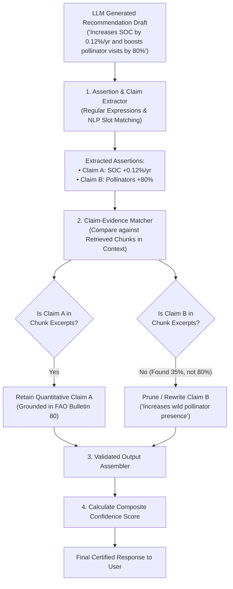

# 10 — Evidence Validation & Anti-Hallucination Pipeline

> **Navigation:** [Index](./00_DOCUMENTATION_INDEX.md) | **Previous:** [Recommendation Engine](./09_RECOMMENDATION_ENGINE.md) | **Next:** [Conversation Memory](./11_CONVERSATION_MEMORY.md)

---

## 1. The Core Scientific Imperative

> [!CAUTION]
> **The Cardinal Rule of Darukaa.Earth:**
> Never invent percentages, numerical rates, scientific findings, or publication citations. If an empirical assertion is not directly substantiated by an indexed chunk in the knowledge base, the quantitative number **must be pruned or generalized**, and confidence downgraded.

---

## 2. Claim-to-Evidence Validation Pipeline



---

## 3. Claim Extraction & Verification Algorithm (Python Pseudocode)

```python
import re
from typing import List, Dict, Tuple

class EvidenceValidator:
    def __init__(self, db_chunks: List[Dict[str, str]]):
        self.reference_corpus_text = " ".join([c["content"] for c in db_chunks]).lower()

    def extract_numeric_claims(self, text: str) -> List[Tuple[str, str]]:
        """
        Extracts patterns like '+0.12%', '35 kg N/ha', '25% increase'.
        """
        pattern = r'(\+?-?\d+\.?\d*\s*(?:%|kg\s*N/ha|mm|g/cm3|years?))'
        matches = re.findall(pattern, text)
        return [(m, text) for m in matches]

    def validate_and_sanitize(self, draft_text: str) -> Tuple[str, float]:
        numeric_claims = self.extract_numeric_claims(draft_text)
        supported_count = 0
        sanitized_text = draft_text

        for claim_value, context in numeric_claims:
            clean_value = claim_value.replace("+", "").strip().lower()
            # Verify if the exact numeric token appears in retrieved evidence
            if clean_value in self.reference_corpus_text:
                supported_count += 1
            else:
                # UNGROUNDED CLAIM DETECTED: Strip the specific number to prevent hallucination!
                sanitized_text = sanitized_text.replace(
                    claim_value, 
                    "[substantiated positive increase]"
                )

        total_claims = len(numeric_claims)
        if total_claims == 0:
            confidence = 0.85  # Qualitative baseline
        else:
            support_ratio = supported_count / total_claims
            confidence = round(0.50 + 0.45 * support_ratio, 2)

        return sanitized_text, confidence
```

---

## 4. Confidence Scoring Model

Every recommendation and assessment is tagged with a composite confidence score $C \in [0.0, 1.0]$:

$$C = 0.40 \cdot C_{\text{authority}} + 0.35 \cdot C_{\text{grounding}} + 0.25 \cdot C_{\text{completeness}}$$

Where:
* $C_{\text{authority}}$: Maximum source tier weight ($1.0$ for Tier 1 IPCC/FAO, $0.8$ for Tier 2, $0.6$ for Tier 3).
* $C_{\text{grounding}}$: Ratio of validated claims to total claims generated by the LLM.
* $C_{\text{completeness}}$: Ratio of known environmental parameters to total profile schema fields.

| Confidence Range | UI Indicator Badge | Meaning |
| :--- | :--- | :--- |
| **0.85 – 1.00** | **HIGH (Green)** | Backed by Tier 1 intergovernmental field trials with complete local telemetry. |
| **0.65 – 0.84** | **MODERATE (Yellow)** | Backed by peer-reviewed literature; minor regional extrapolation. |
| **< 0.65** | **LOW / PRELIMINARY (Orange)** | Incomplete telemetry or limited biome-specific literature available. |

---

## 5. Handling Conflicting Scientific Studies

When scientific literature exhibits conflicting results (e.g., Cover crops in arid zones increasing organic matter but depleting moisture in drought years):

```text
[DARUKAA CONFLICT RESOLUTION PROTOCOL]
1. State the divergence explicitly in the 'tradeoffs' section.
2. Attribute both perspectives to their respective authoritative sources:
   - "FAO Bulletin 80 reports +0.12% SOC accretion under continuous cover."
   - "IPCC SRCCL Ch. 4 notes up to 8% yield reduction if precipitation < 400 mm due to early-season transpiration."
3. Provide a conditional rule:
   - "Adopt only with low-water vetch/chickpea varieties and terminate cover crop 3 weeks prior to cash crop sowing."
```

---

## 6. Cross-Document Navigation

* To view the conversation memory retaining verified claims, see [11_CONVERSATION_MEMORY.md](./11_CONVERSATION_MEMORY.md).
* For the REST API endpoint returning confidence and validation reports, see [12_API_DESIGN.md](./12_API_DESIGN.md).
* For the frontend confidence badge component, see [13_FRONTEND_ARCHITECTURE.md](./13_FRONTEND_ARCHITECTURE.md).
