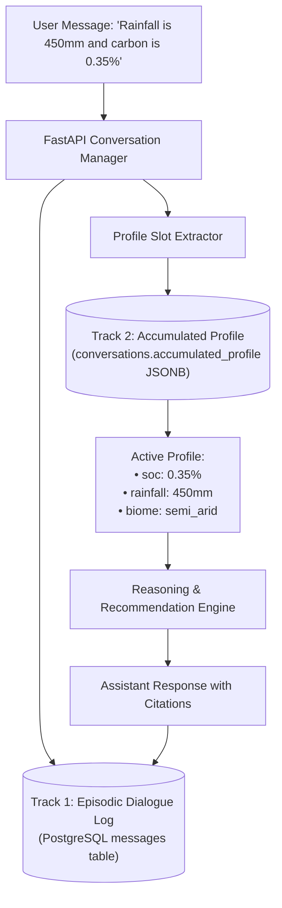

# 11 — Conversation Memory & Environmental Profile Accumulator

> **Navigation:** [Index](./00_DOCUMENTATION_INDEX.md) | **Previous:** [Evidence Validation](./10_EVIDENCE_VALIDATION.md) | **Next:** [API Design](./12_API_DESIGN.md)

---

## 1. Dual-Track Memory Architecture

In environmental advisory, dialogues are rarely one-shot interactions. Users provide clues gradually, correct preliminary estimates, and ask follow-up questions about specific recommendations.

Darukaa.Earth implements a **Dual-Track Memory System**:
1. **Dialogue History Track (Episodic):** Standard chronological message stream (`role: user | assistant`) stored in PostgreSQL `messages` table for conversational fluency.
2. **Structured Profile Track (Semantic State):** An evolving JSONB state accumulator in table `conversations.accumulated_profile` that stores validated biophysical numbers and updates them dynamically upon user correction.



---

## 2. Dynamic Slot-Filling & State Evolution Sequence

```mermaid
sequenceDiagram
    autonumber
    actor User
    participant System as Darukaa Assistant
    participant Memory as State Accumulator (JSONB)

    Note over User, System: Turn 1: Problem statement without metrics
    User->>System: "My biodiversity is collapsing and soil is turning dusty."
    System->>Memory: Inspect profile slots
    Memory-->>System: {soc: null, rainfall: null, land_use: null}
    System-->>User: "To assist you, please provide: 1. Soil Organic Carbon (SOC), 2. Annual rainfall (mm), 3. Current crop/land use."

    Note over User, System: Turn 2: User provides structured metrics
    User->>System: "Carbon is 0.35%, rainfall is 450 mm, and we grow monoculture wheat."
    System->>Memory: Update slots: {soc: 0.35, rainfall: 450, land_use: 'wheat_monoculture'}
    Memory-->>System: Slots complete!
    System-->>User: Outputs multi-metric analysis & ranked interventions (Legume Intercropping Rank 1).

    Note over User, System: Turn 3: User corrects an earlier measurement
    User->>System: "Wait, our recent lab test shows carbon was actually 0.55%, not 0.35%."
    System->>Memory: Patch slot: {soc: 0.55} (Preserves rainfall: 450, land_use: 'wheat_monoculture')
    Memory-->>System: Re-evaluate stress vectors
    System-->>User: "Updated profile with SOC = 0.55%. Soil stress adjusted from CRITICAL to HIGH; Legume Intercropping remains recommended."
```

---

## 3. Profile Schema Definition (Pydantic v2)

```python
from pydantic import BaseModel, Field
from typing import Optional, List

class AccumulatedEnvironmentalProfile(BaseModel):
    # Soil Metrics
    soc_percent: Optional[float] = Field(None, ge=0.0, le=20.0, description="Soil Organic Carbon %")
    soil_ph: Optional[float] = Field(None, ge=3.0, le=11.0, description="Soil pH level")
    soil_moisture_percent: Optional[float] = Field(None, ge=0.0, le=100.0)
    
    # Climate Metrics
    annual_rainfall_mm: Optional[float] = Field(None, ge=0.0, le=5000.0)
    max_temp_celsius: Optional[float] = Field(None, ge=-20.0, le=60.0)
    biome: Optional[str] = Field("semi_arid", description="Identified regional biome")
    
    # Land & Biodiversity Metrics
    land_use: Optional[str] = Field(None, description="Primary crop or land use pattern")
    monoculture_score: Optional[float] = Field(1.0, ge=0.0, le=1.0)
    observed_pollinators: Optional[int] = Field(None, ge=0)
    
    # Active Diagnosed States
    active_compound_risks: List[str] = Field(default_factory=list)
    previous_recommendations: List[str] = Field(default_factory=list)

    def is_executable(self) -> bool:
        """Determines if sufficient metrics exist to trigger reasoning engine."""
        return (
            self.soc_percent is not None and 
            self.annual_rainfall_mm is not None and 
            self.land_use is not None
        )
```

---

## 4. Context Window Truncation & Distillation Strategy

To guarantee the LLM context stays within fast, low-cost token bounds during extended conversations:
1. **Profile Persistence:** The `AccumulatedEnvironmentalProfile` is injected into the system prompt as a concise 10-line YAML/JSON block on every turn.
2. **Sliding Window:** Only the last **6 conversational turns** are passed as raw text. Older messages are summarized into a 2-sentence background synopsis stored in `conversations.metadata->'summary'`.

---

## 5. Cross-Document Navigation

* For API endpoints managing conversation creation and profile inspection, see [12_API_DESIGN.md](./12_API_DESIGN.md).
* For frontend state visualization of the live profile drawer, see [13_FRONTEND_ARCHITECTURE.md](./13_FRONTEND_ARCHITECTURE.md).
* For end-to-end user sequences demonstrating memory, see [14_USER_FLOWS.md](./14_USER_FLOWS.md).
