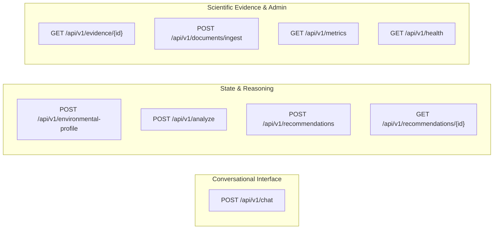

# 12 — API Design & REST Specifications

> **Navigation:** [Index](./00_DOCUMENTATION_INDEX.md) | **Previous:** [Conversation Memory](./11_CONVERSATION_MEMORY.md) | **Next:** [Frontend Architecture](./13_FRONTEND_ARCHITECTURE.md)

---

## 1. Overview & Protocol Standards

The Darukaa.Earth backend is implemented in **FastAPI** (Python 3.11). All communication is conducted over HTTPS using standard JSON payloads conforming to OpenAPI 3.0 standards.

### Global Headers & Authentication
* For the 24-hour hackathon MVP, requests use an optional session header: `X-Session-ID: <uuid>`. If omitted, the API automatically provisions and returns a new session.
* All timestamp formats conform to ISO 8601 (`YYYY-MM-DDTHH:MM:SSZ`).
* Standard error wrapper:
```json
{
  "success": false,
  "error": {
    "code": "VALIDATION_ERROR",
    "message": "Field 'soc_percent' must be between 0.0 and 20.0"
  }
}
```

---

## 2. Endpoint Catalog



---

## 3. Detailed Endpoint Specifications

### 3.1 `POST /api/v1/chat`
**Purpose:** Primary conversational interaction endpoint. Ingests user messages, performs entity extraction and slot filling, evaluates state, and triggers clarification or reasoning.

#### Request Body:
```json
{
  "session_id": "3fa85f64-5717-4562-b3fc-2c963f66afa6",
  "message": "Rainfall is 450 mm, SOC is 0.35%, and we grow continuous wheat monoculture."
}
```

#### Response (200 OK — Analysis Complete):
```json
{
  "success": true,
  "status": "ANALYSIS_COMPLETE",
  "session_id": "3fa85f64-5717-4562-b3fc-2c963f66afa6",
  "response": "Based on your environmental telemetry, your land is experiencing **Critical Compound Soil-Moisture-Biodiversity Degradation**.",
  "profile": {
    "soc_percent": 0.35,
    "annual_rainfall_mm": 450.0,
    "land_use": "wheat_monoculture",
    "biome": "semi_arid"
  },
  "diagnostics": [
    "Severe Soil Organic Carbon exhaustion (<0.5% threshold).",
    "High hydrological water deficit.",
    "Monoculture floral desert with collapsed pollinator presence."
  ],
  "recommendations": [
    {
      "id": "rec_legume_intercrop_01",
      "rank": 1,
      "action": "Legume Intercropping with Chickpea (Cicer arietinum)",
      "confidence": 0.92,
      "target_metrics": ["soc_percent", "floral_nectar_continuity"],
      "citations": ["fao_soil_bulletin_80"]
    }
  ]
}
```

#### Response (200 OK — Clarification Required):
```json
{
  "success": true,
  "status": "CLARIFICATION_REQUIRED",
  "session_id": "3fa85f64-5717-4562-b3fc-2c963f66afa6",
  "response": "To accurately evaluate compound ecological stress, please provide your current annual rainfall (mm) and land use type.",
  "missing_fields": ["annual_rainfall_mm", "land_use"]
}
```

---

### 3.2 `POST /api/v1/environmental-profile`
**Purpose:** Directly upserts structured biophysical measurements for a session without parsing chat text.

#### Request Body:
```json
{
  "session_id": "3fa85f64-5717-4562-b3fc-2c963f66afa6",
  "soc_percent": 0.45,
  "soil_ph": 7.8,
  "annual_rainfall_mm": 480.0,
  "max_temp_celsius": 33.0,
  "land_use": "wheat_monoculture",
  "biome": "semi_arid"
}
```

#### Response (200 OK):
```json
{
  "success": true,
  "session_id": "3fa85f64-5717-4562-b3fc-2c963f66afa6",
  "profile_status": "READY_FOR_ANALYSIS",
  "compound_risk_index": 0.88
}
```

---

### 3.3 `POST /api/v1/analyze`
**Purpose:** Triggers the pure deterministic multi-metric reasoning matrix on an explicit profile payload.

#### Request Body:
```json
{
  "soc_percent": 0.35,
  "annual_rainfall_mm": 450.0,
  "max_temp_celsius": 34.0,
  "monoculture_score": 1.0
}
```

#### Response (200 OK):
```json
{
  "success": true,
  "stress_vectors": {
    "soil_stress": 0.88,
    "water_stress": 0.82,
    "biodiversity_stress": 0.94,
    "compound_risk": 1.00
  },
  "risk_classification": "CRITICAL",
  "allowed_practices": ["carbon_building", "drought_tolerant_legume", "pollinator_buffer_strip"],
  "forbidden_practices": ["high_water_demand_cover_crop"]
}
```

---

### 3.4 `GET /api/v1/evidence/{id}`
**Purpose:** Fetches full scientific provenance, peer-reviewed excerpt, DOI, and organization for a specific evidence chunk cited in a recommendation.

#### Response (200 OK):
```json
{
  "success": true,
  "evidence_id": "chunk_fao_recarb_v2_p142",
  "citation_key": "FAO (2021)",
  "title": "Recarbonizing Global Soils - Volume 2: Cropland Management Practices",
  "organization": "Food and Agriculture Organization of the United Nations (FAO)",
  "publication_year": 2021,
  "doi": "10.4060/ca9280en",
  "authority_tier": 1,
  "excerpt": "Semi-arid cereal-legume rotations yielded annual SOC increases of 0.12% with significant biological nitrogen-fixing benefits, provided legume varieties are drought-adapted.",
  "relevance_score": 0.94
}
```

---

### 3.5 `POST /api/v1/documents/ingest`
**Purpose:** Admin endpoint to ingest raw scientific markdown or text into `evidence_chunks` with automated chunking and embeddings.

#### Request Body:
```json
{
  "source_citation_key": "ipcc_srccl_ch4",
  "title": "IPCC Special Report on Climate Change and Land, Chapter 4",
  "organization": "IPCC",
  "year": 2019,
  "doi": "10.1017/9781009157988.006",
  "authority_tier": 1,
  "biome": "dryland",
  "content_text": "Perennial vegetative buffer strips on field perimeters increase wild pollinator visitation by 30-45% within two crop cycles while reducing soil wind erosion."
}
```

---

### 3.6 `GET /api/v1/health`
**Purpose:** Liveness and readiness probe for Docker / AWS orchestrators.

#### Response (200 OK):
```json
{
  "status": "healthy",
  "database": "connected",
  "pgvector_extension": "active",
  "llm_provider": "available"
}
```

---

## 4. Cross-Document Navigation

* To see how frontend components bind to these endpoints, see [13_FRONTEND_ARCHITECTURE.md](./13_FRONTEND_ARCHITECTURE.md).
* For sequence diagrams illustrating user journeys across these APIs, see [14_USER_FLOWS.md](./14_USER_FLOWS.md).
* For endpoint security, rate-limiting, and validation middleware, see [16_SECURITY_RELIABILITY.md](./16_SECURITY_RELIABILITY.md).
