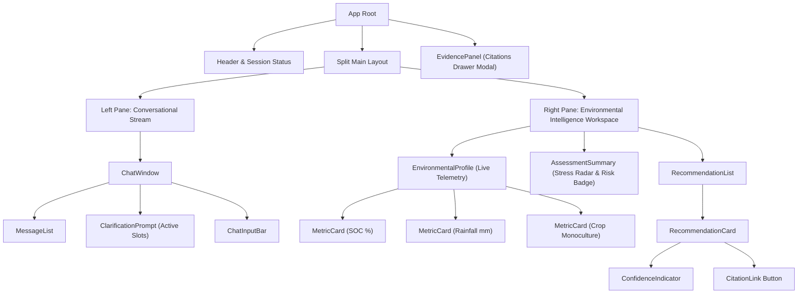
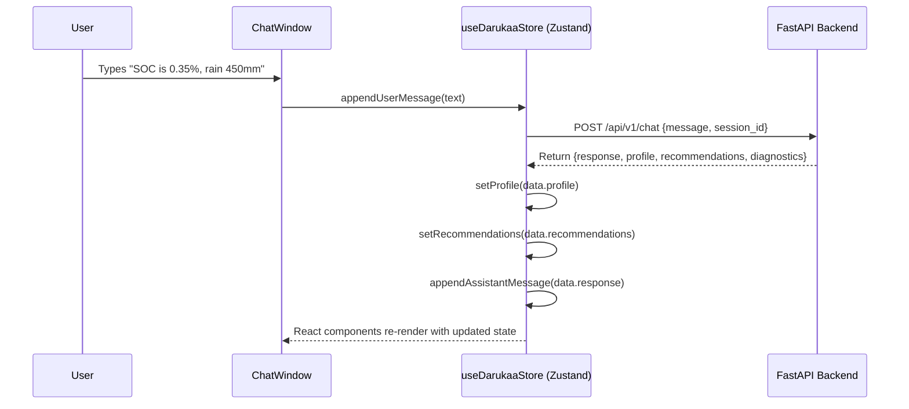

# 13 — Frontend Architecture & UI Component Design

> **Navigation:** [Index](./00_DOCUMENTATION_INDEX.md) | **Previous:** [API Design](./12_API_DESIGN.md) | **Next:** [User Flows](./14_USER_FLOWS.md)

---

## 1. UI Philosophy & Purpose

The Darukaa.Earth frontend is engineered in **React 18 + TypeScript + Vite**. 

> [!NOTE]
> The primary purpose of the UI is not decorative aesthetics; it is **to make the AI's multi-metric reasoning, active data state, and scientific evidence immediately visible and auditable**.

---

## 2. Component Hierarchy



---

## 3. UI Layout Wireframe

```text
┌─────────────────────────────────────────────────────────────────────────────────────────────┐
│  🌍 DARUKAA.EARTH — AI Biodiversity Intelligence Engine              [Session: #3fa85f64]    │
├──────────────────────────────────────────────┬──────────────────────────────────────────────┤
│  CONVERSATIONAL ADVISORY STREAM              │  ENVIRONMENTAL PROFILE & INTELLIGENCE RADAR  │
│                                              │                                              │
│  [User] 10:14 AM                             │  ┌─ TELEMETRY DASHBOARD ───────────────────┐ │
│  "My soil is turning hard and dusty."        │  │ SOC: 0.35% (CRITICAL)   Rain: 450 mm/yr  │ │
│                                              │  │ pH: 7.8 (Alkaline)      Crop: Wheat Mono │ │
│  [Darukaa] 10:14 AM                          │  └─────────────────────────────────────────┘ │
│  "To evaluate compound risk, please enter    │                                              │
│  your SOC and annual rainfall."              │  ┌─ STRESS ASSESSMENT ─────────────────────┐ │
│                                              │  │ COMPOUND RISK: CRITICAL (1.00 / 1.0)    │ │
│  [User] 10:15 AM                             │  │ • Soil Degradation: 0.88               │ │
│  "SOC is 0.35% and rainfall is 450 mm."      │  │ • Water Vulnerability: 0.82             │ │
│                                              │  │ • Biodiversity Stress: 0.94             │ │
│  [Darukaa] 10:15 AM                          │  └─────────────────────────────────────────┘ │
│  "Critical compound stress detected. Low     │                                              │
│  carbon accelerates water infiltration       │  ┌─ RANKED INTERVENTIONS ──────────────────┐ │
│  deficit. Recommending drought-hardy legumes"│  │ #1 Legume Intercropping (Chickpea)      │ │
│                                              │  │    Confidence: 92% (High)               │ │
│                                              │  │    Target: +0.12% SOC/yr, -35kg N/ha    │ │
│                                              │  │    Tradeoff: Minor early moisture risk  │ │
│                                              │  │    [View FAO Scientific Evidence (3)]   │ │
│                                              │  └─────────────────────────────────────────┘ │
├──────────────────────────────────────────────┴──────────────────────────────────────────────┤
│  [ Input message or soil test results...                                     ] [ Send ➔ ]   │
└─────────────────────────────────────────────────────────────────────────────────────────────┘
```

---

## 4. Frontend State Management Flow (Zustand)



### TypeScript Store Definition (`src/store/useDarukaaStore.ts`):
```typescript
import { create } from 'zustand';

export interface EnvironmentalProfile {
  soc_percent: number | null;
  annual_rainfall_mm: number | null;
  soil_ph: number | null;
  land_use: string | null;
  biome: string;
}

export interface Recommendation {
  id: string;
  rank: number;
  action: string;
  confidence: number;
  reason: string;
  target_metrics: string[];
  expected_direction: Record<string, string>;
  tradeoffs: Array<{ risk: string; severity: string; mitigation: string }>;
  evidence: Array<{ chunk_id: string; source: string; excerpt: string }>;
}

interface DarukaaState {
  sessionId: string;
  messages: Array<{ role: 'user' | 'assistant'; content: string }>;
  profile: EnvironmentalProfile;
  recommendations: Recommendation[];
  isLoading: boolean;
  selectedEvidenceChunk: any | null;
  sendMessage: (msg: string) => Promise<void>;
  updateProfileDirectly: (fields: Partial<EnvironmentalProfile>) => Promise<void>;
  setSelectedEvidence: (chunk: any | null) => void;
}
```

---

## 5. Component Responsibilities

| Component | File Path | Key Props / State | Visual / Interaction Role |
| :--- | :--- | :--- | :--- |
| **`ChatWindow`** | `src/components/ChatWindow.tsx` | `messages`, `onSend` | Renders conversation thread with markdown formatting and citation hover cards. |
| **`EnvironmentalProfile`** | `src/components/EnvironmentalProfile.tsx` | `profile` | Interactive side drawer displaying active physical variables with live edit badges. |
| **`AssessmentSummary`** | `src/components/AssessmentSummary.tsx` | `stress_vectors` | Renders compound risk gauge and normalized stress radar chart. |
| **`RecommendationCard`** | `src/components/RecommendationCard.tsx` | `recommendation` | Cards showcasing ranked actions, trade-offs, and expected directional metric shifts. |
| **`EvidencePanel`** | `src/components/EvidencePanel.tsx` | `chunk` | Slide-over drawer presenting the complete peer-reviewed study, DOI, and chunk text. |
| **`ConfidenceIndicator`**| `src/components/ConfidenceIndicator.tsx`| `score (0-1)` | Color-coded badge (Green/Yellow/Orange) showing mathematical grounding confidence. |

---

## 6. Cross-Document Navigation

* For user interaction paths and state transitions, see [14_USER_FLOWS.md](./14_USER_FLOWS.md).
* For the REST API contracts feeding this client, see [12_API_DESIGN.md](./12_API_DESIGN.md).
* For instructions on testing frontend components, see [17_TESTING_STRATEGY.md](./17_TESTING_STRATEGY.md).
