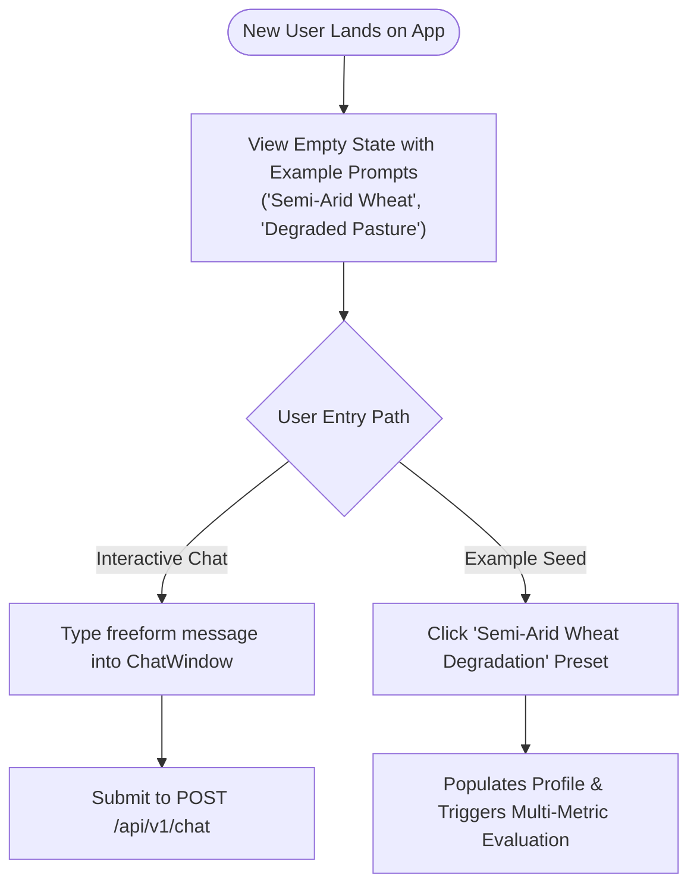
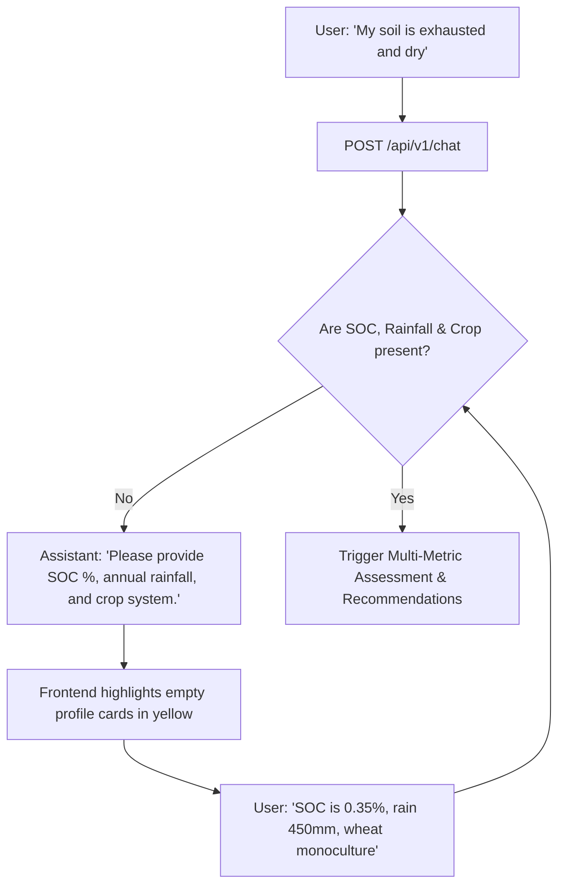
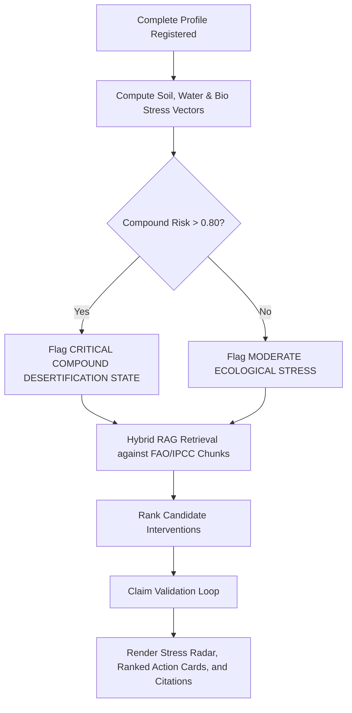
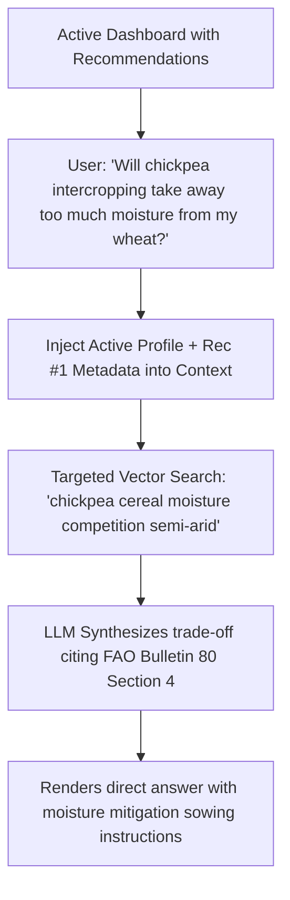
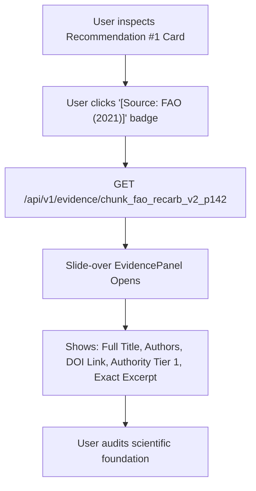
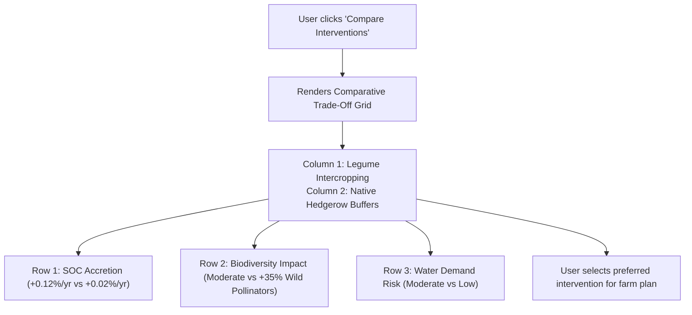
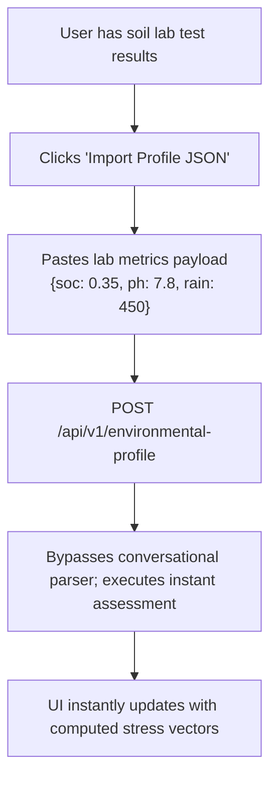
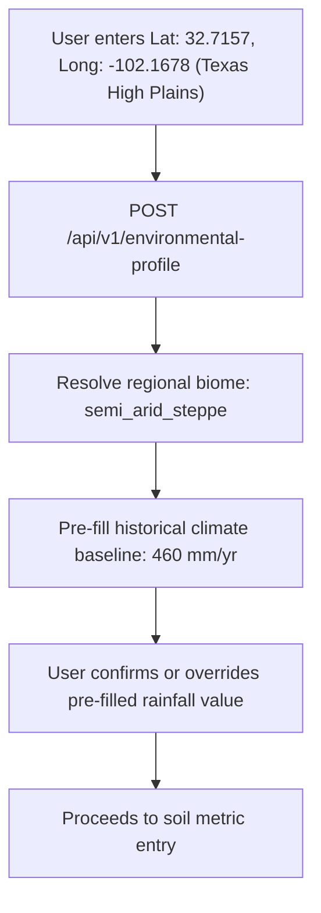

# 14 — User Flows & Interaction Journeys

> **Navigation:** [Index](./00_DOCUMENTATION_INDEX.md) | **Previous:** [Frontend Architecture](./13_FRONTEND_ARCHITECTURE.md) | **Next:** [Deployment Architecture](./15_DEPLOYMENT_ARCHITECTURE.md)

---

## 1. Flow Overview

Darukaa.Earth supports both conversational inquiries and direct dashboard data manipulation. Below are the 8 primary user interaction flows.

---

## 2. The 8 Core User Interaction Journeys

### Flow 1: New User First Visit & Onboarding

---

### Flow 2: Incomplete Environmental Query (Clarification Loop)

---

### Flow 3: Complete Assessment Generation

---

### Flow 4: Conversational Follow-Up & Deep Dive

---

### Flow 5: Scientific Evidence Inspection

---

### Flow 6: Recommendation Comparison & Trade-Off Matrix

---

### Flow 7: Direct Structured JSON / Lab Data Import

---

### Flow 8: Optional Geo-Coordinates Input

---

## 3. Cross-Document Navigation

* To see the deployment architecture running these flows, see [15_DEPLOYMENT_ARCHITECTURE.md](./15_DEPLOYMENT_ARCHITECTURE.md).
* For testing user flows with concrete assertions, see [17_TESTING_STRATEGY.md](./17_TESTING_STRATEGY.md).
* For the exact live demo execution of these flows, see [19_DEMO_SCRIPT.md](./19_DEMO_SCRIPT.md).
