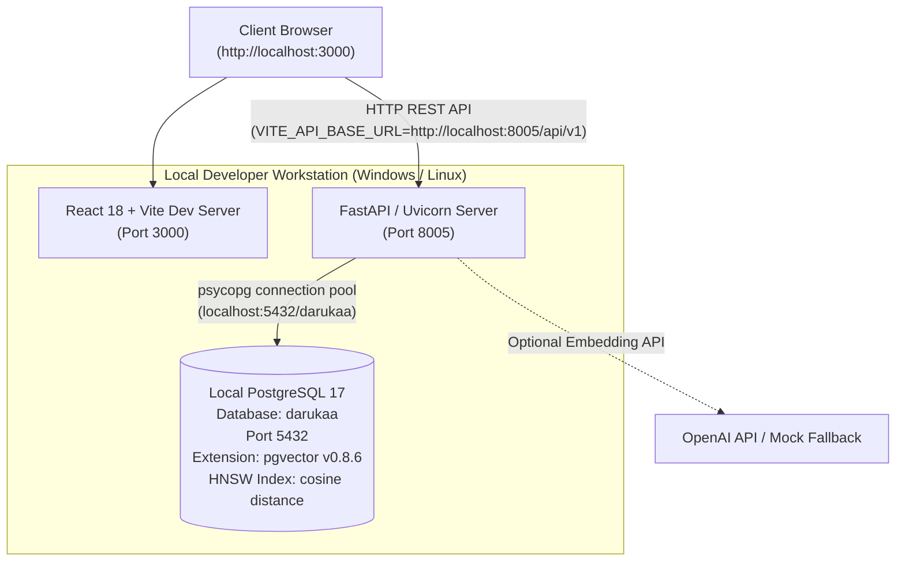
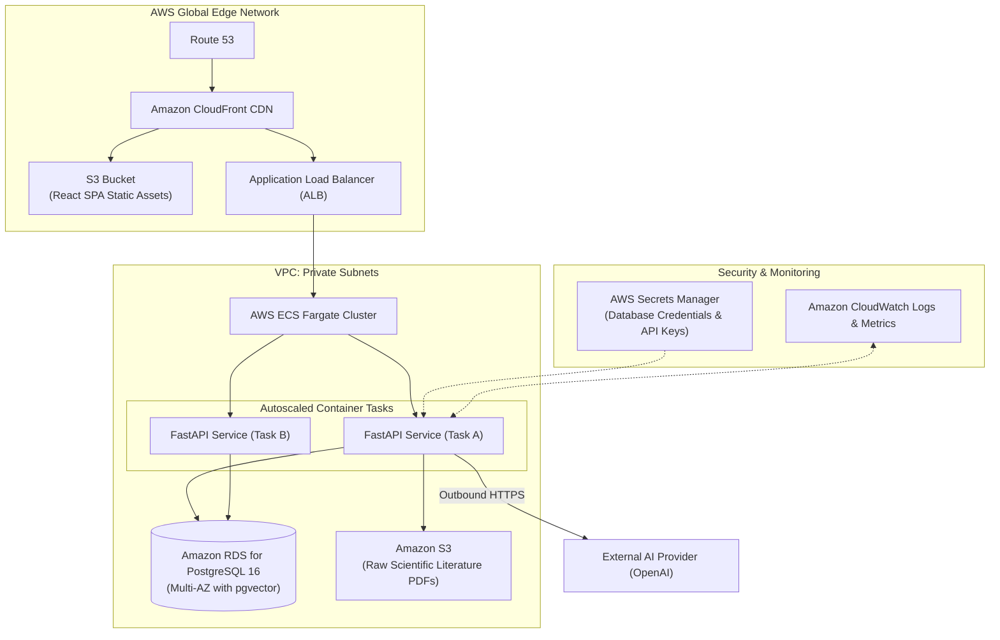

# 15 — Deployment Architecture & Infrastructure

> **Navigation:** [Index](./00_DOCUMENTATION_INDEX.md) | **Previous:** [User Flows](./14_USER_FLOWS.md) | **Next:** [Security & Reliability](./16_SECURITY_RELIABILITY.md)

---

## 1. Environment Architecture Tracks

To respect the 24-hour hackathon constraint while demonstrating architectural clarity, this document explicitly separates:
1. **The Actual 24-Hour Hackathon Environment (Active):** Native local development using local PostgreSQL 17 with compiled `pgvector` v0.8.6 extension on port 5432, FastAPI on port 8005, and React 18 + Vite on port 3000. Zero cloud dependencies, zero external vector SaaS.
2. **The Production Evolution Target (Future):** Scalable AWS multi-tier architecture using AWS ECS Fargate, AWS RDS PostgreSQL with pgvector, and CloudFront.

---

## 2. Active Hackathon Local Architecture (Native & Direct)



### Local Configuration Summary
* **PostgreSQL:** `localhost:5432`, database: `darukaa`, user: `postgres`, password: `root`
* **pgvector Extension:** Native binary `vector` v0.8.6 installed, dimension 1536, HNSW index `idx_evidence_chunks_hnsw`
* **Backend:** FastAPI running on `http://127.0.0.1:8005`
* **Frontend:** React 18 + Vite running on `http://localhost:3000`
* **CORS:** Restricted to `http://localhost:3000`

### `docker-compose.yml` Specification (MVP)
```yaml
version: '3.8'

services:
  database:
    image: pgvector/pgvector:pg16
    container_name: darukaa_db
    environment:
      POSTGRES_DB: darukaa_db
      POSTGRES_USER: postgres
      POSTGRES_PASSWORD: ${DB_PASSWORD:-hackathon_secret}
    ports:
      - "5432:5432"
    volumes:
      - darukaa_pgdata:/var/lib/postgresql/data
      - ./data/init.sql:/docker-entrypoint-initdb.d/init.sql
    restart: unless-stopped

  backend:
    build:
      context: ./backend
      dockerfile: Dockerfile
    container_name: darukaa_backend
    environment:
      DATABASE_URL: postgresql://postgres:${DB_PASSWORD:-hackathon_secret}@database:5432/darukaa_db
      OPENAI_API_KEY: ${OPENAI_API_KEY}
      PORT: 8000
    ports:
      - "8000:8000"
    depends_on:
      - database
    restart: unless-stopped

  frontend:
    build:
      context: ./frontend
      dockerfile: Dockerfile
    container_name: darukaa_frontend
    environment:
      VITE_API_URL: http://localhost:8000/api/v1
    ports:
      - "3000:3000"
    depends_on:
      - backend
    restart: unless-stopped

volumes:
  darukaa_pgdata:
```

---

## 3. Production AWS Evolution Architecture



---

## 4. Environment Variables Configuration (`.env.example`)

```bash
# Database Configuration
DB_HOST=database
DB_PORT=5432
DB_NAME=darukaa_db
DB_USER=postgres
DB_PASSWORD=hackathon_secret_replace_in_prod

# OpenAI Configuration
OPENAI_API_KEY=sk-proj-your_actual_openai_key_here
EMBEDDING_MODEL=text-embedding-3-small
LLM_REASONING_MODEL=gpt-4o

# Backend Server Configuration
ENVIRONMENT=development
LOG_LEVEL=info
CORS_ORIGINS=http://localhost:3000,http://localhost:5173

# Security
SESSION_SECRET_KEY=generate_random_32_byte_hex_string
```

---

## 5. Hackathon Deployment Checklist (Launch in 15 Minutes)

1. Clone repository to host machine.
2. Create `.env` file with `OPENAI_API_KEY`.
3. Run `docker-compose up --build -d`.
4. Run the seed script: `docker-compose exec backend python scripts/seed_corpus.py`.
5. Open browser at `http://localhost:3000` — the system is fully operational.

---

## 6. Cross-Document Navigation

* To configure security policies and secret protection, see [16_SECURITY_RELIABILITY.md](./16_SECURITY_RELIABILITY.md).
* For the full 24-hour hour-by-hour deployment schedule, see [18_MVP_IMPLEMENTATION_PLAN.md](./18_MVP_IMPLEMENTATION_PLAN.md).
* For long-term cloud infrastructure plans, see [21_FUTURE_ROADMAP.md](./21_FUTURE_ROADMAP.md).
