# 18 — 24-Hour MVP Implementation Plan & Execution Sprint

> **Navigation:** [Index](./00_DOCUMENTATION_INDEX.md) | **Previous:** [Testing Strategy](./17_TESTING_STRATEGY.md) | **Next:** [Demo Script](./19_DEMO_SCRIPT.md)

---

## 1. 24-Hour Sprint Overview

To deliver an evidence-grounded AI Biodiversity Intelligence System in 24 hours, scope creep must be eliminated, and development must follow a disciplined, sequential dependency timeline.

### Team Role Allocation (3-Person Hackathon Team)
* **Engineer 1 (Backend & Database):** PostgreSQL 16 schema, pgvector setup, FastAPI REST routes, Docker Compose.
* **Engineer 2 (AI, Reasoning & RAG):** Document chunking, hybrid retrieval pipeline, multi-metric reasoning engine, evidence validation.
* **Engineer 3 (Frontend & Presentation):** React + Vite UI, chat stream, telemetry drawer, stress radar chart, demo polish.

---

## 2. Hour-by-Hour Execution Timetable

```mermaid
gantt
    title 24-Hour Hackathon Delivery Timeline
    dateFormat HH:mm
    axisFormat %H:%M

    section Infrastructure & Data
    Repo Setup & Docker Compose      :done, a1, 00:00, 2h
    PostgreSQL & pgvector DDL        :done, a2, 02:00, 2h
    Corpus Ingestion & Embeddings    :active, a3, 04:00, 2h

    section Core Intelligence
    Multi-Metric Reasoning Engine    :b1, 06:00, 2h
    Recommendation Engine & Scoring  :b2, 08:00, 2h
    Hybrid RAG & Claim Validator     :b3, 10:00, 2h

    section API & Frontend
    FastAPI Endpoints & Contracts    :c1, 12:00, 2h
    React Chat & Telemetry Drawer    :c2, 14:00, 2h
    End-to-End System Integration    :c3, 16:00, 2h

    section Testing & Polish
    Benchmark Testing & Edge Cases   :d1, 18:00, 2h
    Demo Rehearsal & Video Backup    :d2, 20:00, 2h
    Final Pitch Polish & Submission  :d3, 22:00, 2h
```

---

### Detailed 2-Hour Phase Breakdown

#### Hours 00:00 – 02:00: Foundation & Environment
* Initialize Git repository, `.env.example`, and `docker-compose.yml`.
* Launch PostgreSQL 16 container with `pgvector` extension enabled.
* Scaffold `backend/` (FastAPI) and `frontend/` (Vite + React + Tailwind).
* *Milestone:* All 3 containers run cleanly on `docker-compose up`.

#### Hours 02:00 – 04:00: Database & Schema Provisioning
* Execute DDL script from [05_DATABASE_DESIGN.md](./05_DATABASE_DESIGN.md).
* Verify table creation: `conversations`, `messages`, `evidence_chunks`, `interventions`, `metric_relationships`.
* Create HNSW index on `evidence_chunks.embedding` and GIN index on `tsv`.
* *Milestone:* Database ready for automated ingestion.

#### Hours 04:00 – 06:00: Scientific Corpus Ingestion & Embeddings
* Run `scripts/seed_corpus.py` to ingest 35+ core chunks from FAO Bulletin 80, IPCC SRCCL Ch. 4, and IPBES 2018.
* Generate embeddings using OpenAI `text-embedding-3-small` (1536 dims).
* Seed `interventions` catalog with 8 core ecological practices.
* *Milestone:* SQL query verifies semantic similarity search returns relevant chunks in $< 15\text{ ms}$.

#### Hours 06:00 – 08:00: Multi-Metric Reasoning Engine
* Implement `MultiMetricReasoningEngine` in `backend/services/reasoning_engine.py` following [08_REASONING_ENGINE.md](./08_REASONING_ENGINE.md).
* Code deterministic threshold functions ($s_{\text{soc}}, s_{\text{water}}, s_{\text{mono}}$) and compound synergy formula.
* Unit test edge cases (TC-01, TC-03, TC-04).
* *Milestone:* Engine correctly outputs `CRITICAL` compound risk on semi-arid wheat monoculture inputs.

#### Hours 08:00 – 10:00: Recommendation Engine & Scoring
* Implement multi-objective scoring formula in `backend/services/recommendation_engine.py`.
* Implement candidate filtering rules (prohibit water-heavy cover crops in arid zones).
* Output standardized recommendation JSON schema from [09_RECOMMENDATION_ENGINE.md](./09_RECOMMENDATION_ENGINE.md).
* *Milestone:* System outputs ranked recommendations with explicit trade-offs and confidence scores.

#### Hours 10:00 – 12:00: Hybrid RAG & Claim Validation
* Implement hybrid search combining `pgvector` and PostgreSQL `tsvector` with Reciprocal Rank Fusion.
* Implement `EvidenceValidator` to strip ungrounded numerical claims from LLM drafts.
* Test against TC-06 to ensure hallucinated numbers are purged.
* *Milestone:* Generated text is strictly verified against source chunks.

#### Hours 12:00 – 14:00: FastAPI Router & Session Memory
* Build endpoints: `POST /api/v1/chat`, `POST /api/v1/environmental-profile`, `GET /api/v1/evidence/{id}`.
* Implement slot-filling parser to detect incomplete inputs and return `CLARIFICATION_REQUIRED`.
* Wire `accumulated_profile` persistence in PostgreSQL.
* *Milestone:* Full conversational loop works via Swagger UI (`/docs`).

#### Hours 14:00 – 16:00: React Frontend Development
* Build `ChatWindow.tsx`, `EnvironmentalProfile.tsx`, `AssessmentSummary.tsx`, and `RecommendationCard.tsx`.
* Connect Zustand store to FastAPI endpoints.
* Implement slide-over `EvidencePanel.tsx` modal for DOI citation audit.
* *Milestone:* User can submit chat query and see live telemetry drawer update.

#### Hours 16:00 – 18:00: End-to-End System Integration
* Connect frontend and backend within Docker Compose.
* Test incomplete query flow: User says *"My land is dying"* $\rightarrow$ system prompts for missing SOC/Rain $\rightarrow$ user supplies metrics $\rightarrow$ UI renders radar chart and recommendations.
* Fix CORS, payload discrepancies, and CSS alignment.
* *Milestone:* Complete, unbroken user flow operational.

#### Hours 18:00 – 20:00: Benchmark Testing & Edge Case Hardening
* Run all 10 benchmark test cases from [17_TESTING_STRATEGY.md](./17_TESTING_STRATEGY.md).
* Add friendly error boundaries for invalid soil test numbers.
* Tune confidence scoring weights.
* *Milestone:* 100% pass rate on test cases TC-01 through TC-10.

#### Hours 20:00 – 22:00: Demo Rehearsal & Fallback Packaging
* Rehearse the 3-minute pitch following [19_DEMO_SCRIPT.md](./19_DEMO_SCRIPT.md).
* Record a 1080p high-resolution screen-capture video walkthrough as an offline backup in case of venue Wi-Fi failure.
* Freeze codebase; no new features permitted.
* *Milestone:* Polished demo narrative delivered in $< 4$ minutes.

#### Hours 22:00 – 24:00: Final Polish & Submission
* Verify root `README.md` and documentation links.
* Prepare slide deck emphasizing: Problem $\rightarrow$ Multi-Metric Reasoning vs Chatbot $\rightarrow$ Evidence Validation $\rightarrow$ Live Demo.
* Submit repository link and celebrate.
* *Milestone:* Project successfully submitted.

---

## 3. Priority Matrix (MoSCoW)

| Priority | Feature / Component | Justification |
| :--- | :--- | :--- |
| **CRITICAL (Must)** | PostgreSQL + pgvector schema, Multi-Metric Reasoning Engine, Slot-Filling Clarifications, Seed FAO/IPCC Corpus, FastAPI Backend, React Chat + Telemetry Drawer. | Non-negotiable for proving the core differentiator to judges. |
| **HIGH (Should)** | Claim Validation anti-hallucination loop, Citation audit slide-over drawer, JSON profile import, Compound risk radar chart. | Visually elevates project from standard hackathon prototype to scientific intelligence engine. |
| **MEDIUM (Could)**| Geo-coordinate biome lookup, CSV soil test upload, PDF report export. | Implement only if ahead of schedule at Hour 18. |
| **LOW (Won't)** | Satellite raster ingestion, multi-tenant authentication, Kafka message buses. | Explicitly deferred to post-hackathon roadmap. |

---

## 4. Cross-Document Navigation

* To follow the rehearsed live pitch, see [19_DEMO_SCRIPT.md](./19_DEMO_SCRIPT.md).
* For preparing answers to judge questions, see [20_JUDGE_QA.md](./20_JUDGE_QA.md).
* For features reserved for subsequent iterations, see [21_FUTURE_ROADMAP.md](./21_FUTURE_ROADMAP.md).
