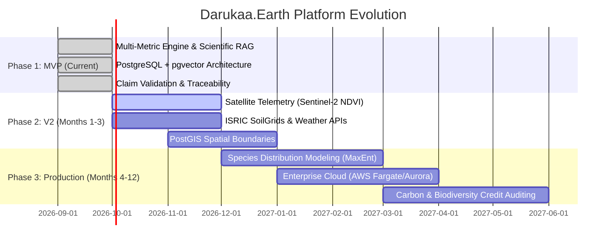
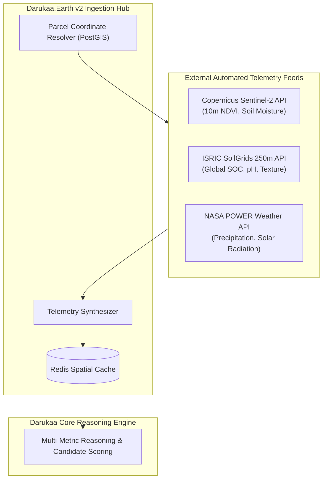

# 21 — Future Roadmap: Beyond the Hackathon

> **Navigation:** [Index](./00_DOCUMENTATION_INDEX.md) | **Previous:** [Judge Q&A](./20_JUDGE_QA.md)

---

## 1. Evolution Strategy & Architectural Phasing

To preserve engineering velocity during the 24-hour sprint, Darukaa.Earth strictly compartmentalized what belongs in the **Hackathon MVP** versus what is scheduled for **Version 2 (Near-Term)** and **Enterprise Production (Long-Term)**.

---

## 2. Phased Architectural Comparison

| Capability | Phase 1: Hackathon MVP (Current) | Phase 2: Version 2 (3 Months) | Phase 3: Global Production (12 Months) |
| :--- | :--- | :--- | :--- |
| **Environmental Telemetry** | User-entered numeric input & JSON profile import | Automated satellite raster ingestion (Sentinel-2 NDVI/NDWI) + ISRIC SoilGrids API | Real-time on-farm IoT soil probe mesh telemetry + hyperspectral drone scans |
| **Spatial Engine** | Qualitative biomes (e.g. `semi_arid`) | PostGIS geometry polygon boundaries for farm parcels | Multi-spectral global spatial tile server & dynamic watershed topological routing |
| **Scientific Corpus** | 50+ curated chunks from FAO, IPCC, IPBES | 2,500+ indexed papers with automated weekly preprint ingestion | 50,000+ peer-reviewed studies with automated citation graph ranking |
| **Knowledge Graph** | Relational PostgreSQL rules in `metric_relationships` | Neo4j / RDF ontologies linking ecological practices and species | Distributed semantic graph with real-time bio-causality reasoning |
| **Biodiversity Modeling** | Indicator scores (pollinators, canopy cover) | GBIF (Global Biodiversity Information Facility) species occurrence overlay | Machine learning species distribution models (MaxEnt) and CMIP6 climate projections |
| **Validation & Safety** | Automated regex & semantic claim extraction | Semi-automated agronomist review workflow (Human-in-the-loop) | ISO-certified ecological verification engine for nature-positive credits |
| **Infrastructure** | Single-node Docker Compose on EC2 / Lightsail | AWS ECS Fargate + Amazon RDS PostgreSQL | Multi-region Kubernetes (EKS) + Kafka event streaming + Redis caching |

---

## 3. Phase 2 Architecture (Near-Term)

---

## 4. Phase 3: Global Enterprise Platform (Long-Term Vision)

### 1. Automated Nature Credit Certification (Verra / Gold Standard)
Darukaa.Earth will generate cryptographically verifiable ecological restoration reports. By tracking multi-year shifts in SOC, water retention, and wild pollinator diversity against IPCC and FAO baselines, landowners can prove carbon sequestration and biodiversity gains for premium credit issuance.

### 2. Species Distribution Modeling (SDM)
Integrating MaxEnt ecological models to predict how native plant, insect, and bird species ranges will shift under 2030–2050 IPCC climate warming scenarios, ensuring that planted windbreaks and hedgerows remain viable decades into the future.

### 3. Human-in-the-Loop Agronomic Network
Creating an audited marketplace where certified regional agronomic extension scientists review, annotate, and endorse high-stakes municipal or watershed-level recommendations generated by the AI engine.

---

## 5. Cross-Document Navigation

* Return to the master navigation index at [00_DOCUMENTATION_INDEX.md](./00_DOCUMENTATION_INDEX.md).
* Review the current MVP design at [03_SYSTEM_DESIGN.md](./03_SYSTEM_DESIGN.md).
* Review the 24-hour sprint plan at [18_MVP_IMPLEMENTATION_PLAN.md](./18_MVP_IMPLEMENTATION_PLAN.md).
